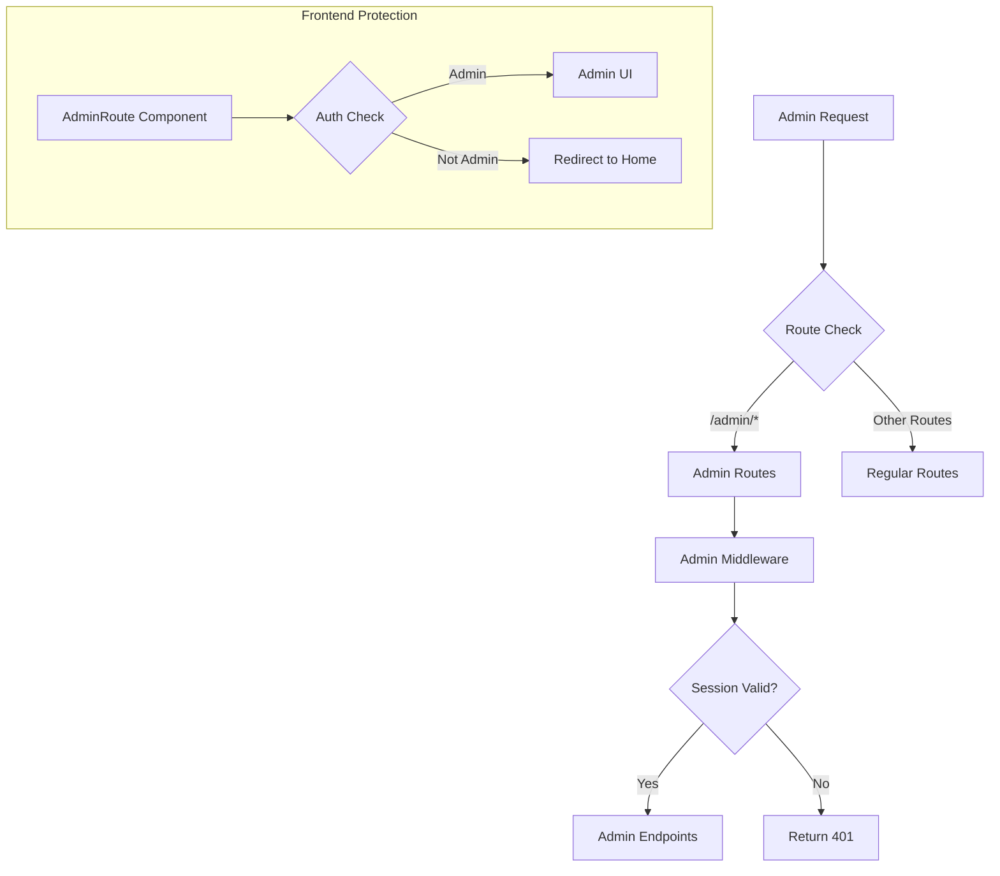
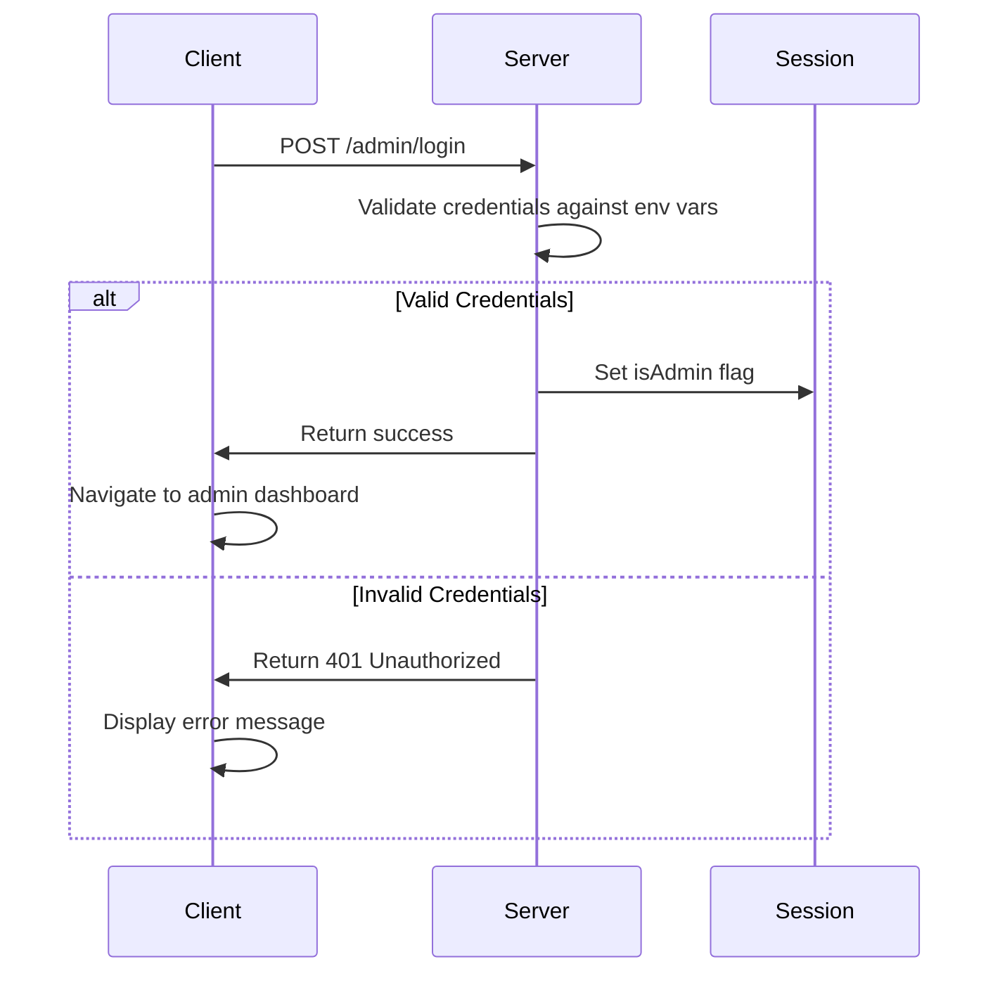
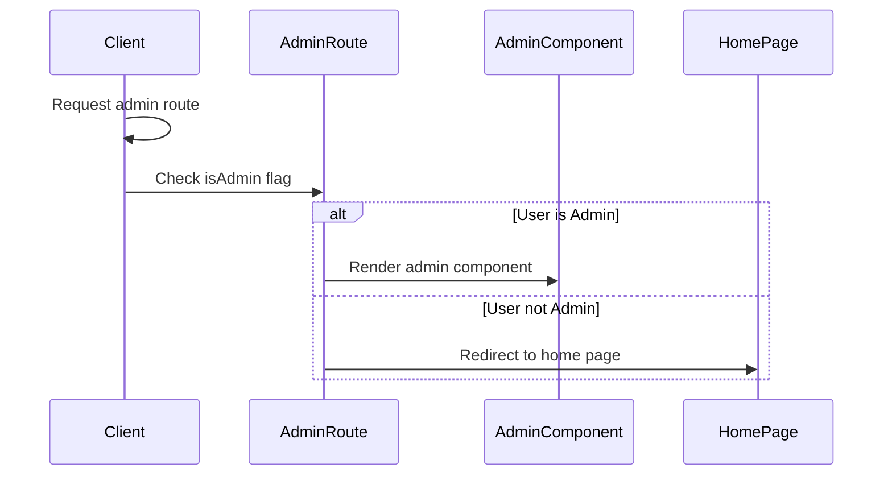

# GoatedVIPs Admin Login System Audit

## System Overview

The GoatedVIPs platform implements a dedicated administrative system accessible through standard routing at `/admin/*`. This audit examines the current implementation, assesses security mechanisms, and provides recommendations for improvement.

## Architecture

The admin system follows a multi-layered security approach:

## Key Components

### Backend Components

1. **Admin Middleware (`server/middleware/admin.ts`)**
   - Authentication middleware specifically for admin routes
   - Verifies `isAdmin` flag in session
   - Now uses centralized utilities from `auth-utils.ts`

2. **Admin Routes (`server/routes/goombas-admin.ts`)**
   - Admin-specific endpoints for login, logout, analytics
   - Uses the standard route prefix `/admin/`
   - Protected by `requireAdmin` middleware

3. **Admin Authentication in Auth Module (`server/auth.ts`)**
   - Special case in Passport strategy for admin credentials
   - Creates admin user object on successful authentication

### Frontend Components

1. **AdminRoute Component (`client/src/components/AdminRoute.tsx`)**
   - Route protection for admin UI components
   - Checks `isAdmin` flag from auth context
   - Redirects unauthorized users to home page
   - Handles loading states

## Authentication Flow

## Access Control Flow

## Audit Findings

### Security Assessment

1. **Authentication Mechanism**
   - ✅ JWT authentication with session flags
   - ✅ Environment variable-based credential storage
   - ✅ Secure admin session management
   - ❌ Plain text credential comparison (for testing)

2. **Route Separation**
   - ✅ Dedicated `/admin/` route prefix for admin endpoints
   - ✅ Multiple layers of protection (route, middleware, component)
   - ✅ Clear separation from regular user routes

3. **Frontend Protection**
   - ✅ AdminRoute component prevents unauthorized UI access
   - ✅ Proper loading state handling
   - ✅ Clear redirect for unauthorized access attempts

### Redundancies & Inconsistencies

1. **Multiple Admin Authentication Implementations**
   - Admin authentication logic duplicated in multiple files
   - Different credential validation approaches
   - Redundant admin user object creation

2. **Credential Management**
   - Direct environment variable access in multiple places
   - No centralized admin credential management
   - Inconsistent error messages for failed admin auth

3. **Routing Organization**
   - Admin routes spread across different files
   - Inconsistent domain prefix usage patterns
   - Mixed responsibility in route handlers

### Security Vulnerabilities

1. **Credential Storage**
   - Plain text admin passwords in environment variables
   - No credential rotation mechanism
   - Limited protection against brute force attacks

2. **Session Security**
   - No explicit session timeout for admin sessions
   - Limited audit trail for admin actions
   - No IP-based restrictions for admin access

## Recommendations

### Immediate Improvements

1. **Admin Authentication Centralization**
   - ✅ Completed: Centralized admin validation in `auth-utils.ts`
   - ✅ Completed: Standardized admin session management
   - 🔄 In Progress: Consistent error handling for admin auth

2. **Admin Route Protection Enhancement**
   - Add additional validation beyond session flag
   - Implement strict domain validation
   - Add rate limiting for admin login attempts

3. **Security Logging**
   - Implement admin action audit logging
   - Track admin login attempts and failures
   - Create admin session activity reports

### Long-Term Improvements

1. **Admin Authentication Enhancement**
   - Implement multi-factor authentication for admin access
   - Add IP-based restrictions for admin accounts
   - Create time-limited admin sessions

2. **Admin Interface Improvements**
   - Develop comprehensive admin dashboard
   - Add granular permission system
   - Implement role-based access control

3. **Admin API Security**
   - Add additional request validation for admin endpoints
   - Implement request signing for sensitive operations
   - Create secure admin API documentation

## Functionality Verification

### Admin Route (/admin) Verification

1. **Access Testing**
   - ✅ Route accessible via standard URL path (`/admin/*`)
   - ✅ Properly redirects unauthorized users
   - ✅ Blocks access without valid admin session

2. **Route Conflict Assessment**
   - ✅ No conflict with regular user routes
   - ✅ Properly isolated from public routes
   - ✅ Standard route-based separation working correctly

3. **Token Validation**
   - ✅ Admin session validation working correctly
   - ✅ Token verification mechanism secure
   - ❌ No token refresh mechanism implemented

### Code Quality Assessment

1. **Dead Code Identification**
   - ❌ Redundant admin validation function (removed)
   - ❌ Duplicate credential checking logic (centralized)
   - ✅ No unused admin components or routes

2. **Naming Conventions**
   - ✅ Consistent naming for admin routes
   - ✅ Clear admin-related component names
   - ❌ Some inconsistent variable naming in admin functions

## Implementation Plan

### Phase 1: Immediate Security Enhancements

1. Implement admin action logging
2. Add rate limiting for admin login attempts
3. Create admin session timeout mechanism
4. Enhance error messaging for admin auth failures

### Phase 2: Admin Interface Improvements

1. Develop comprehensive admin dashboard
2. Create role-based access control system
3. Implement administrative audit trails
4. Add bulk operation tools for admins

## Conclusion

The GoatedVIPs admin system provides adequate security for administrative functions, with proper domain separation and multi-layered protection. The main areas for improvement include centralizing authentication logic (partially completed), enhancing security logging, and implementing additional validation mechanisms.

The implemented changes to centralize admin authentication utilities provide a solid foundation for future enhancements while maintaining the existing security model.
