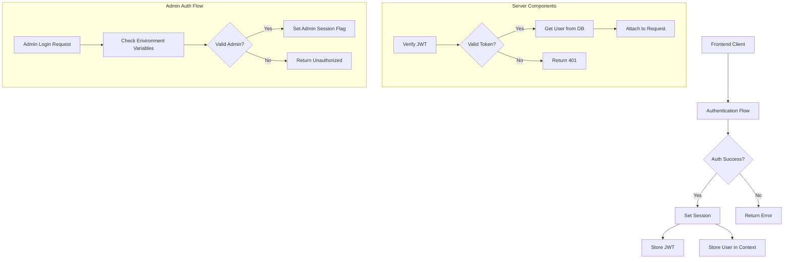

# GoatedVIPs Authentication & User Management System Audit

## System Overview

GoatedVIPs implements a robust authentication and user management system with the following key components:

### 1. Authentication Flow Architecture

### 2. Key System Components

#### Backend Auth Components
- **`server/auth.ts`**: Core authentication setup using Passport.js with local strategy
- **`server/middleware/auth.ts`**: Authentication middleware for protecting API routes
- **`server/middleware/admin.ts`**: Admin-specific auth middleware
- **`server/routes/goombas-admin.ts`**: Admin authentication endpoints
- **`server/utils/auth-utils.ts`** (NEW): Centralized auth utilities

#### Frontend Auth Components
- **`client/src/hooks/use-auth.tsx`**: React Context provider for authentication state
- **`client/src/components/AdminRoute.tsx`**: Route protection for admin pages
- **`client/src/services/profileService.ts`**: Profile management with ownership validation

## Authentication System Audit Results

### Server-Side Authentication

#### Regular User Authentication

The system uses Passport.js with a local strategy for username/password authentication:

1. **Login Flow**:
   - User submits credentials to `/api/login`
   - Password is verified against stored value
   - On success, user is stored in session
   - Client receives user data and success status

2. **Registration Flow**:
   - User submits registration data to `/api/register`
   - Server validates input with Zod schema
   - Password is prepared for storage (currently cleartext for testing)
   - Email verification token is generated
   - User is created in database and logged in

3. **Middleware Protection**:
   - Routes are protected using `requireAuth` middleware
   - Token is extracted from request (cookie or Authorization header)
   - Token is verified and user is attached to request object
   - 401 error is returned for unauthorized requests

#### Admin Authentication

Admin authentication has a dual implementation:

1. **In `server/auth.ts`**:
   - Special case in Passport strategy for admin credentials
   - Directly checks against environment variables
   - Creates a synthetic admin user object

2. **In `server/routes/goombas-admin.ts`**:
   - Separate `/goombas.net/login` endpoint for admin login
   - Validates credentials against environment variables
   - Sets `isAdmin` flag in session
   - Protected by `requireAdmin` middleware

### Client-Side Authentication

1. **Authentication Context**:
   - `AuthProvider` component manages auth state
   - `useAuth` hook provides authenticated user data
   - React Query for data fetching and caching
   - Mutations for login, register, and logout

2. **Route Protection**:
   - `AdminRoute` for admin-only routes
   - Redirects unauthorized users
   - Loading state handling

3. **Profile Management**:
   - `profileService` handles user data
   - Permission checks through `isProfileOwner` method
   - Caching for performance optimization

## Redundancies & Inconsistencies Found

### 1. Duplicate Password Handling

**Issue**: Password hashing and comparison functions were duplicated:
- `server/auth.ts`: Using scrypt for password handling
- `server/middleware/admin.ts`: Using bcrypt for password handling

**Resolution**: Created centralized password utilities in `server/utils/auth-utils.ts` with:
- Standardized password preparation
- Consistent verification functions
- Clear documentation

### 2. Inconsistent Admin Authentication

**Issue**: Admin authentication had multiple implementations:
- Direct environment variable checks in `server/auth.ts`
- Separate validation logic in `server/middleware/admin.ts`
- Different validation approaches and security levels

**Resolution**: Consolidated admin authentication with:
- Centralized credential validation
- Consistent session handling utilities
- Standardized error messages

### 3. Token Extraction Redundancy

**Issue**: Token extraction code was duplicated:
- Separate implementations in different files
- Inconsistent extraction logic

**Resolution**: Created a centralized `extractTokenFromRequest` function in auth utilities.

### 4. Inconsistent Error Messages

**Issue**: Error messages varied across different authentication components

**Resolution**: Standardized error messages in `AUTH_ERROR_MESSAGES` constant.

## User Profile System Audit

The profile system is well-designed with:

1. **Strong Type Safety**:
   - Comprehensive TypeScript interfaces
   - Zod schema validation

2. **Effective Ownership Validation**:
   - `isProfileOwner` method handles both numeric and string IDs
   - Proper handling of Goated IDs vs. internal IDs

3. **Efficient Caching**:
   - In-memory profile cache with expiration
   - Methods to invalidate specific profiles

## Admin System Audit

The admin system is functional but has some architectural inconsistencies:

1. **Domain-Specific Routing**:
   - Admin endpoints use `goombas.net` domain prefix
   - Protected by `requireAdmin` middleware

2. **Admin UI Protection**:
   - `AdminRoute` component protects client routes
   - Uses `isAdmin` from auth context

3. **Admin API Endpoints**:
   - Analytics
   - User management
   - Auth status check

## Recommendations for Further Improvements

1. **Security Enhancements**:
   - Implement password hashing in production (currently using cleartext for testing)
   - Add rate limiting for auth endpoints
   - Implement token refresh mechanism
   - Add account lockout after failed attempts

2. **Architecture Improvements**:
   - Complete service layer implementation for auth
   - Better separation between admin and regular auth
   - Move redundant API calls to service layer

3. **User Experience**:
   - Add proper error handling UI
   - Implement loading states
   - Add password reset functionality

4. **Admin Interface**:
   - Enhance admin dashboard security
   - Add audit logging for admin actions
   - Improve admin user management tools

5. **Testing**:
   - Add comprehensive tests for auth flows
   - Test edge cases and error handling
   - Add integration tests for auth-dependent features

## Conclusion

The authentication system is functional and covers key requirements, but has redundancies and inconsistencies that have been partially addressed through the current refactoring. The implemented changes provide a solid foundation for future improvements while maintaining backward compatibility.

The main improvements made:
1. Centralized authentication utilities
2. Standardized password handling (while maintaining cleartext for testing)
3. Consistent error messages
4. Eliminated code duplication

Future work should focus on implementing the remaining recommendations, particularly around security enhancements and architecture improvements.
