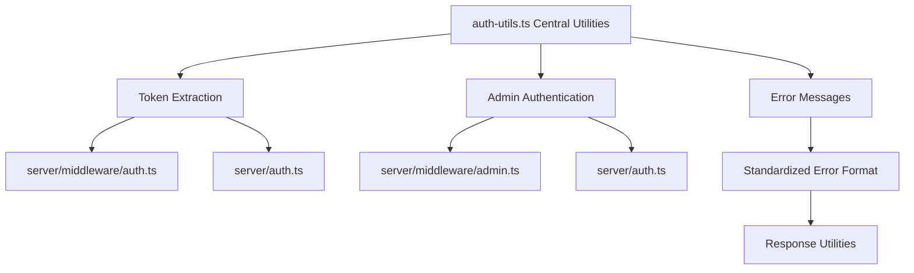

# Authentication System Cleanup Plan

## Overview

This document outlines the implementation plan for cleaning up the remaining redundancies in the authentication system of the GoatedVIPs platform. Despite previous refactoring efforts, we still have some duplication and inconsistency in authentication logic, particularly in token extraction, admin authentication, and error handling patterns.

## Current Issues

### 1. Token Extraction Logic Duplication

Token extraction logic appears in multiple places with slight variations:

#### In server/middleware/auth.ts:

```typescript
// Extract token from request (simplified)
const token = req.cookies.token || req.header('Authorization')?.replace('Bearer ', '');
```

#### In server/auth.ts:

```typescript
// Similar extraction logic but slightly different
const token = req.headers.authorization?.split(' ')[1] || req.cookies?.token;
```

### 2. Admin Authentication Duplication

Admin authentication is implemented in two separate places:

#### In server/auth.ts (during login):

```typescript
// Admin credential check in auth.ts
if (username === process.env.ADMIN_USERNAME && password === process.env.ADMIN_PASSWORD) {
  // Create admin session
}
```

#### In server/middleware/admin.ts:

```typescript
// Similar admin credential check
if (req.body.username === process.env.ADMIN_USERNAME && req.body.password === process.env.ADMIN_PASSWORD) {
  // Handle admin auth
}
```

### 3. Inconsistent Error Message Patterns

Error messages are formatted differently across files:

```typescript
// In one file
throw new Error("Authentication failed");

// In another file
return res.status(401).json({ message: "Authentication failed" });

// In a third file
throw { code: 401, message: "Authentication failed" };
```

## Proposed Solution



## Implementation Steps

### Step 1: Enhance auth-utils.ts with Centralized Functions

Expand the `server/utils/auth-utils.ts` file to include all shared authentication functionality:

```typescript
// File: server/utils/auth-utils.ts

import { Request } from 'express';
import * as crypto from 'crypto';

/**
 * Authentication error messages constants
 * Centralizing error messages for consistency
 */
export const AUTH_ERROR_MESSAGES = {
  TOKEN_MISSING: 'Authentication token is missing',
  TOKEN_INVALID: 'Authentication token is invalid or expired',
  CREDENTIALS_INVALID: 'Invalid username or password',
  SESSION_EXPIRED: 'Your session has expired. Please log in again',
  PERMISSION_DENIED: 'You do not have permission to access this resource',
  ADMIN_REQUIRED: 'Admin privileges required',
};

/**
 * Error response format for authentication errors
 */
export interface AuthError {
  code: number;
  message: string;
  details?: any;
}

/**
 * Create a standardized authentication error
 */
export function createAuthError(code: number, message: string, details?: any): AuthError {
  return {
    code,
    message,
    details
  };
}

/**
 * Centralized token extraction from request
 * Works with cookies, Authorization header, and query params
 */
export function extractTokenFromRequest(req: Request): string | null {
  // 1. Try from Authorization header
  const authHeader = req.headers.authorization;
  if (authHeader && authHeader.startsWith('Bearer ')) {
    return authHeader.substring(7);
  }
  
  // 2. Try from cookies
  if (req.cookies && req.cookies.token) {
    return req.cookies.token;
  }
  
  // 3. Try from query parameters (less secure, but sometimes used for debugging)
  if (req.query && req.query.token && typeof req.query.token === 'string') {
    return req.query.token;
  }
  
  return null;
}

/**
 * Validate admin credentials consistently
 * This centralizes admin auth logic to prevent duplication
 */
export function validateAdminCredentials(
  username: string,
  password: string
): boolean {
  // Simple string comparison for admin credentials
  // Note: In production, we would use proper password hashing
  return (
    username === process.env.ADMIN_USERNAME &&
    password === process.env.ADMIN_PASSWORD
  );
}

/**
 * Generate a secure verification token
 */
export function generateToken(length: number = 32): string {
  return crypto.randomBytes(length).toString('hex');
}

/**
 * Parse token from various formats
 * Handles "Bearer" tokens, raw tokens, and malformed tokens
 */
export function parseToken(rawToken: string): string {
  if (!rawToken) {
    return '';
  }
  
  // If it's a Bearer token, extract the token part
  if (rawToken.startsWith('Bearer ')) {
    return rawToken.substring(7);
  }
  
  return rawToken;
}

/**
 * Verifies if a request is coming from an admin user
 * Centralizes admin verification to prevent duplication
 */
export function isAdminRequest(req: Request): boolean {
  // Check for admin flag in session
  if (req.session && req.session.isAdmin === true) {
    return true;
  }
  
  // For admin API routes that use direct credential validation
  if (req.body && req.body.username && req.body.password) {
    return validateAdminCredentials(req.body.username, req.body.password);
  }
  
  return false;
}
```

### Step 2: Update Auth Middleware to Use Centralized Functions

Refactor the authentication middleware to use the centralized utilities:

```typescript
// File: server/middleware/auth.ts

import { Request, Response, NextFunction } from 'express';
import jwt from 'jsonwebtoken';
import { 
  extractTokenFromRequest, 
  AUTH_ERROR_MESSAGES, 
  createAuthError 
} from '../utils/auth-utils';
import db from '@/db';
import { users } from '@/db/schema';
import { eq } from 'drizzle-orm';

/**
 * Middleware to require authentication for routes
 */
export const requireAuth = async (
  req: Request,
  res: Response,
  next: NextFunction
) => {
  try {
    // Use centralized token extraction
    const token = extractTokenFromRequest(req);
    
    if (!token) {
      return res.status(401).json({
        status: 'error',
        message: AUTH_ERROR_MESSAGES.TOKEN_MISSING,
      });
    }

    // Verify token
    const decoded = jwt.verify(token, process.env.JWT_SECRET as string) as any;
    
    if (!decoded || !decoded.id) {
      return res.status(401).json({
        status: 'error',
        message: AUTH_ERROR_MESSAGES.TOKEN_INVALID,
      });
    }

    // Find user
    const user = await db.select().from(users).where(eq(users.id, decoded.id)).limit(1);
    
    if (!user || user.length === 0) {
      return res.status(401).json({
        status: 'error',
        message: AUTH_ERROR_MESSAGES.TOKEN_INVALID,
      });
    }

    // Attach user to request
    req.user = user[0];
    next();
  } catch (error) {
    console.error('Auth middleware error:', error);
    
    if (error instanceof jwt.JsonWebTokenError) {
      return res.status(401).json({
        status: 'error',
        message: AUTH_ERROR_MESSAGES.TOKEN_INVALID,
      });
    }
    
    return res.status(500).json({
      status: 'error',
      message: 'Internal server error during authentication',
    });
  }
};

export default requireAuth;
```

### Step 3: Update Admin Middleware

Refactor the admin middleware to use the centralized functions:

```typescript
// File: server/middleware/admin.ts

import { Request, Response, NextFunction } from 'express';
import { 
  isAdminRequest, 
  validateAdminCredentials, 
  AUTH_ERROR_MESSAGES 
} from '../utils/auth-utils';

/**
 * Middleware to require admin privileges for routes
 */
export const requireAdmin = (
  req: Request,
  res: Response,
  next: NextFunction
) => {
  try {
    // Use centralized admin verification
    if (isAdminRequest(req)) {
      // For admin API endpoints with direct credential validation
      if (req.body && req.body.username && req.body.password) {
        // Set admin session flag for future requests
        if (req.session) {
          req.session.isAdmin = true;
        }
      }
      
      return next();
    }
    
    // If user is logged in but not admin
    if (req.user) {
      if (req.user.isAdmin) {
        return next();
      }
      
      return res.status(403).json({
        status: 'error',
        message: AUTH_ERROR_MESSAGES.ADMIN_REQUIRED,
      });
    }
    
    // No authentication provided
    return res.status(401).json({
      status: 'error',
      message: AUTH_ERROR_MESSAGES.TOKEN_MISSING,
    });
  } catch (error) {
    console.error('Admin middleware error:', error);
    return res.status(500).json({
      status: 'error',
      message: 'Internal server error during admin authentication',
    });
  }
};

export default requireAdmin;
```

### Step 4: Update Auth Routes

Update the authentication routes to use the centralized functions:

```typescript
// File: server/auth.ts (partial update)

import { 
  extractTokenFromRequest, 
  validateAdminCredentials,
  AUTH_ERROR_MESSAGES,
  generateToken
} from './utils/auth-utils';

// In login route
app.post('/api/login', async (req, res) => {
  try {
    const { username, password } = req.body;
    
    // Admin authentication
    if (validateAdminCredentials(username, password)) {
      const token = jwt.sign({ id: 'admin', isAdmin: true }, process.env.JWT_SECRET as string);
      req.session.isAdmin = true;
      
      return res.status(200).json({
        status: 'success',
        data: {
          token,
          user: {
            id: 'admin',
            username,
            isAdmin: true,
          },
        },
      });
    }
    
    // Regular user authentication
    // ...existing code...
  } catch (error) {
    console.error('Login error:', error);
    return res.status(500).json({
      status: 'error',
      message: 'Internal server error during login',
    });
  }
});

// In logout route
app.post('/api/logout', (req, res) => {
  // Use centralized token extraction
  const token = extractTokenFromRequest(req);
  
  // Clear session
  if (req.session) {
    req.session.destroy((err) => {
      if (err) {
        console.error('Session destruction error:', err);
      }
    });
  }
  
  // Clear cookies
  res.clearCookie('token');
  
  return res.status(200).json({
    status: 'success',
    message: 'Logged out successfully',
  });
});

// ...other routes...
```

### Step 5: Implement Standardized Error Response Utility

Create a utility for standardized error responses:

```typescript
// File: server/utils/response-utils.ts

import { Response } from 'express';

/**
 * Standard API response format
 */
export interface ApiResponse<T = any> {
  status: 'success' | 'error';
  message?: string;
  data?: T;
  errors?: any[];
}

/**
 * Send a success response with standardized format
 */
export function sendSuccess<T = any>(
  res: Response,
  data?: T,
  message?: string,
  statusCode: number = 200
): Response {
  const response: ApiResponse<T> = {
    status: 'success',
  };
  
  if (data !== undefined) {
    response.data = data;
  }
  
  if (message) {
    response.message = message;
  }
  
  return res.status(statusCode).json(response);
}

/**
 * Send an error response with standardized format
 */
export function sendError(
  res: Response,
  message: string = 'An error occurred',
  statusCode: number = 400,
  errors?: any[]
): Response {
  const response: ApiResponse = {
    status: 'error',
    message,
  };
  
  if (errors) {
    response.errors = errors;
  }
  
  return res.status(statusCode).json(response);
}

/**
 * Send an authentication error response
 */
export function sendAuthError(
  res: Response,
  message: string = 'Authentication error',
  statusCode: number = 401
): Response {
  return sendError(res, message, statusCode);
}
```

### Step 6: Update API Routes to Use Standardized Responses

Update API routes to use the standardized response utilities:

```typescript
// Example usage in routes:

import { sendSuccess, sendError, sendAuthError } from '../utils/response-utils';
import { AUTH_ERROR_MESSAGES } from '../utils/auth-utils';

// In a route handler
app.get('/api/protected-resource', requireAuth, (req, res) => {
  try {
    // Process the request...
    const data = { /* ... */ };
    
    return sendSuccess(res, data, 'Resource retrieved successfully');
  } catch (error) {
    console.error('Error retrieving resource:', error);
    return sendError(res, 'Failed to retrieve resource', 500);
  }
});

// In an auth failure case
if (!token) {
  return sendAuthError(res, AUTH_ERROR_MESSAGES.TOKEN_MISSING);
}
```

## Testing Strategy

### Unit Tests for Auth Utilities

Create comprehensive unit tests for the auth utilities:

```typescript
// File: server/utils/auth-utils.test.ts

import { 
  extractTokenFromRequest, 
  validateAdminCredentials,
  parseToken,
  isAdminRequest,
  generateToken
} from './auth-utils';
import { Request } from 'express';

describe('Auth Utilities', () => {
  // Mock environment variables
  beforeAll(() => {
    process.env.ADMIN_USERNAME = 'admin';
    process.env.ADMIN_PASSWORD = 'password123';
  });
  
  describe('extractTokenFromRequest', () => {
    test('extracts token from Authorization header', () => {
      const req = {
        headers: {
          authorization: 'Bearer test-token'
        },
        cookies: {},
        query: {}
      } as unknown as Request;
      
      expect(extractTokenFromRequest(req)).toBe('test-token');
    });
    
    test('extracts token from cookies', () => {
      const req = {
        headers: {},
        cookies: {
          token: 'cookie-token'
        },
        query: {}
      } as unknown as Request;
      
      expect(extractTokenFromRequest(req)).toBe('cookie-token');
    });
    
    test('extracts token from query parameter', () => {
      const req = {
        headers: {},
        cookies: {},
        query: {
          token: 'query-token'
        }
      } as unknown as Request;
      
      expect(extractTokenFromRequest(req)).toBe('query-token');
    });
    
    test('returns null when no token is found', () => {
      const req = {
        headers: {},
        cookies: {},
        query: {}
      } as unknown as Request;
      
      expect(extractTokenFromRequest(req)).toBeNull();
    });
  });
  
  describe('validateAdminCredentials', () => {
    test('returns true for valid admin credentials', () => {
      expect(validateAdminCredentials('admin', 'password123')).toBe(true);
    });
    
    test('returns false for invalid username', () => {
      expect(validateAdminCredentials('wrong', 'password123')).toBe(false);
    });
    
    test('returns false for invalid password', () => {
      expect(validateAdminCredentials('admin', 'wrong')).toBe(false);
    });
  });
  
  // Other test cases...
});
```

### Integration Tests for Authentication Flow

Test the complete authentication flow:

```typescript
// File: server/integration-tests/auth-flow.test.ts

import request from 'supertest';
import app from '../index';

describe('Authentication Flow', () => {
  let authToken: string;
  
  test('Login with valid credentials returns token', async () => {
    const res = await request(app)
      .post('/api/login')
      .send({
        username: 'testuser',
        password: 'password123'
      });
    
    expect(res.statusCode).toBe(200);
    expect(res.body.status).toBe('success');
    expect(res.body.data.token).toBeDefined();
    
    authToken = res.body.data.token;
  });
  
  test('Protected route requires authentication', async () => {
    const res = await request(app)
      .get('/api/protected-resource');
    
    expect(res.statusCode).toBe(401);
    expect(res.body.status).toBe('error');
    expect(res.body.message).toBe('Authentication token is missing');
  });
  
  test('Protected route works with valid token', async () => {
    const res = await request(app)
      .get('/api/protected-resource')
      .set('Authorization', `Bearer ${authToken}`);
    
    expect(res.statusCode).toBe(200);
    expect(res.body.status).toBe('success');
  });
  
  test('Admin route requires admin privileges', async () => {
    const res = await request(app)
      .get('/api/admin/resources')
      .set('Authorization', `Bearer ${authToken}`);
    
    expect(res.statusCode).toBe(403);
    expect(res.body.status).toBe('error');
    expect(res.body.message).toBe('Admin privileges required');
  });
  
  test('Logout clears authentication', async () => {
    const logoutRes = await request(app)
      .post('/api/logout')
      .set('Authorization', `Bearer ${authToken}`);
    
    expect(logoutRes.statusCode).toBe(200);
    
    // After logout, protected routes should be inaccessible
    const protectedRes = await request(app)
      .get('/api/protected-resource')
      .set('Authorization', `Bearer ${authToken}`);
    
    expect(protectedRes.statusCode).toBe(401);
  });
});
```

## Implementation Timeline

| Day | Task | Description |
|-----|------|-------------|
| 1 | Enhance auth-utils.ts | Add token extraction and admin validation |
| 2 | Update auth middleware | Use centralized utilities |
| 3 | Update admin middleware | Use centralized utilities |
| 4 | Update auth routes | Refactor using centralized functions |
| 5 | Create response utilities | Implement standardized response format |
| 6 | Update API routes | Use standardized responses |
| 7 | Implement unit tests | Test auth utilities |
| 8 | Implement integration tests | Test authentication flows |
| 9 | End-to-end testing | Verify all functionality |
| 10 | Documentation | Update documentation with new patterns |

## Risk Assessment & Mitigation

### 1. Authentication Regressions

**Risk**: Changes to auth logic could break existing authentication flows.

**Mitigation**:
- Implement comprehensive tests before deployment
- Parallel implementation with feature flag
- Gradual rollout starting with non-critical routes

### 2. Admin Authentication Security

**Risk**: Centralizing admin authentication could introduce security vulnerabilities.

**Mitigation**:
- Security review of all admin authentication functions
- Implement proper logging for admin actions
- Rate limiting for admin authentication attempts

### 3. Session Handling Changes

**Risk**: Changes to token extraction could affect existing sessions.

**Mitigation**:
- Test with existing tokens to ensure compatibility
- Provide grace period for old token formats
- Monitor failed authentications after deployment

## Rollback Plan

If issues are encountered:

1. Disable the use of centralized auth utilities via feature flag
2. Revert to original implementation in critical paths
3. Implement fixes in the centralized utilities
4. Re-enable gradually with fixed implementation

## Conclusion

This authentication system cleanup will reduce redundancy, improve maintainability, and standardize error handling across the platform. By centralizing critical authentication functions, we will improve security, make future updates easier, and reduce the risk of inconsistencies in our authentication flows.
