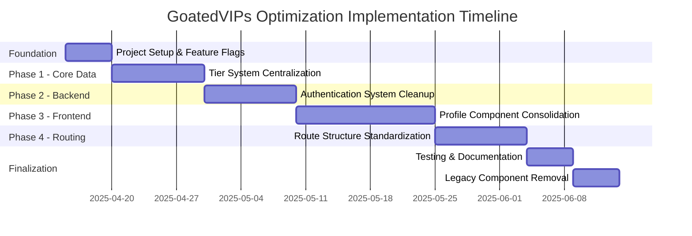
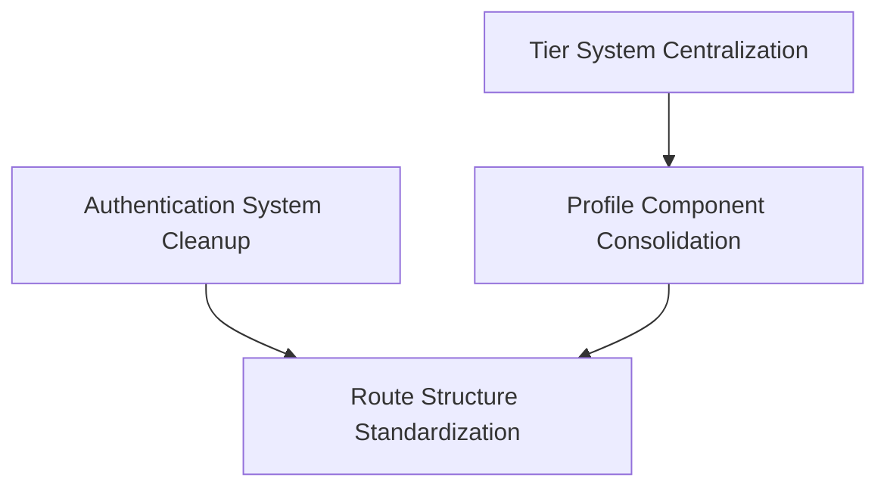

# GoatedVIPs Codebase Optimization Master Plan

## Executive Summary

This document serves as the comprehensive master plan for optimizing the GoatedVIPs codebase by addressing redundancy, standardizing patterns, and improving maintainability. The plan consolidates the detailed strategies from individual optimization plans into a coordinated implementation roadmap.

The optimization focuses on four key areas:

1. **Profile System Consolidation** - Unifying redundant profile components
2. **Tier System Data Centralization** - Creating a single source of truth for tier data
3. **Authentication System Cleanup** - Centralizing authentication utilities and patterns
4. **Route Structure Standardization** - Creating a consistent, maintainable routing system

## Optimization Goals

- **Reduce Code Duplication** - Consolidate redundant implementations
- **Improve Maintainability** - Establish clear patterns and conventions
- **Enhance Performance** - Optimize code execution and resource utilization
- **Ensure Consistency** - Standardize implementation approaches and user experience
- **Enable Scalability** - Create a foundation for future feature development

## Implementation Roadmap

The implementation is organized into sequential phases, with each phase building on the previous one. Each phase addresses specific areas of the codebase while minimizing disruption to ongoing development.

### Phase 0: Project Setup & Feature Flags (Week 1)

**Objective**: Create the foundation for incremental implementation with minimal disruption

**Tasks**:
1. Create feature flag system for controlling rollout
2. Set up comprehensive testing infrastructure
3. Document existing component usage patterns
4. Establish monitoring for detecting issues during rollout

**Key Deliverables**:
- Feature flag configuration system
- Testing framework for validation
- Documentation of current implementation

### Phase 1: Tier System Centralization (Weeks 2-3)

**Objective**: Establish a single source of truth for tier data and calculations

**Tasks**:
1. Create centralized tier data definitions
2. Refactor tier-utils.ts to use centralized data
3. Update VipProgram.tsx to use centralized data
4. Create validation utilities for tier calculations
5. Create comprehensive tests for tier functionality

**Key Deliverables**:
- Centralized tier-definitions.ts file
- Updated tier utility functions
- Validation tools for tier calculations
- Test suite for tier functionality

**See**: [Tier System Consolidation Plan](tier-system-consolidation-plan.md)

### Phase 2: Authentication System Cleanup (Weeks 4-5)

**Objective**: Centralize authentication utilities and standardize patterns

**Tasks**:
1. Enhance auth-utils.ts with comprehensive utilities
2. Update auth middleware to use centralized functions
3. Update admin middleware to use centralized functions
4. Implement standardized response formats
5. Create tests for authentication functionality

**Key Deliverables**:
- Enhanced auth-utils.ts with centralized functionality
- Standardized error response utilities
- Updated middleware using centralized utilities
- Test suite for authentication flows

**See**: [Auth System Cleanup Plan](auth-system-cleanup-plan.md)

### Phase 3: Profile Component Consolidation (Weeks 6-8)

**Objective**: Unify redundant profile components and implement a feature-flagged migration

**Tasks**:
1. Create wrapper components for gradual migration
2. Implement ProfileCard with feature flag support
3. Implement TierProgress with feature flag support
4. Update ProfileLayout to conditionally use enhanced versions
5. Create unified ProfilePage component
6. Gradually enable enhanced components

**Key Deliverables**:
- Unified profile component interfaces
- Feature-flagged component wrappers
- Implementation of gradual migration strategy

**See**: [Profile System Migration Plan](profile-system-migration-plan.md)

### Phase 4: Route Structure Standardization (Weeks 9-10)

**Objective**: Create a consistent, maintainable routing system

**Tasks**:
1. Define route naming conventions
2. Create centralized routes configuration
3. Implement AppRouter component
4. Update App.tsx to use unified routing
5. Create typed route utilities
6. Update components to use standardized routing
7. Implement route guards for protected routes

**Key Deliverables**:
- Centralized routes configuration
- Typed route utilities
- Consistent route naming conventions
- Proper redirects for legacy routes

**See**: [Route Structure Standardization Plan](route-structure-standardization-plan.md)

### Phase 5: Testing & Documentation (Week 11)

**Objective**: Ensure system stability and maintain knowledge for future development

**Tasks**:
1. Implement comprehensive test coverage
2. Create visual regression tests for UI components
3. Update documentation with new patterns
4. Create migration guides for developers

**Key Deliverables**:
- Expanded test coverage
- Updated technical documentation
- Developer migration guides

### Phase 6: Legacy Component Retirement (Week 12)

**Objective**: Complete the migration by removing redundant implementations

**Tasks**:
1. Remove feature flags (defaulting to enhanced versions)
2. Remove legacy component implementations
3. Clean up unused imports and dependencies
4. Verify all functionality works as expected

**Key Deliverables**:
- Clean codebase with redundancies eliminated
- Finalized documentation of implemented patterns

## Dependency Diagram

## Risk Management

### Technical Risks

| Risk | Likelihood | Impact | Mitigation |
|------|------------|--------|------------|
| Authentication regressions | Medium | High | Feature flags, gradual rollout, comprehensive tests |
| Visual inconsistency during transition | High | Medium | Gradual component migration, user feedback collection |
| SEO impact from route changes | Medium | High | Proper redirects, sitemap updates, monitoring |
| Calculation inconsistencies in tier system | Medium | High | Validation script, parallel implementation |

### Implementation Risks

| Risk | Likelihood | Impact | Mitigation |
|------|------------|--------|------------|
| Timeline delays | Medium | Medium | Phased approach, clear prioritization |
| Developer resistance to new patterns | Medium | Low | Documentation, training, clear benefits communication |
| Increased bug reports during transition | High | Medium | Monitoring, quick-fix process, feature flag toggling |
| Performance degradation | Low | Medium | Performance testing, optimization as needed |

## Rollback Strategy

Each phase includes a dedicated rollback strategy:

1. **Feature Flags** - All new implementations can be disabled immediately
2. **Parallel Implementations** - Original code remains functional during transition
3. **Incremental Deployment** - Changes are rolled out gradually by component
4. **Monitoring** - Automated systems detect issues for quick response

## Success Criteria

The optimization will be considered successful when:

1. **Code Duplication Reduced** - 80%+ reduction in duplicated authentication/profile code
2. **Testing Coverage** - 90%+ test coverage for critical paths
3. **Performance** - No degradation in key performance metrics
4. **Developer Experience** - Improved productivity in related feature development
5. **Bug Reduction** - Fewer bugs reported in authentication and profile systems

## Project Team & Responsibilities

| Role | Responsibilities |
|------|-----------------|
| Tech Lead | Overall architecture, design decisions, code reviews |
| Frontend Engineer | Profile component migration, route standardization |
| Backend Engineer | Authentication system cleanup, tier system centralization |
| QA Engineer | Testing strategy, test implementation, validation |
| DevOps | Monitoring, deployment, environment configuration |

## Implementation Checklist

### Foundation
- [ ] Create feature flag system
- [ ] Set up testing infrastructure
- [ ] Document existing patterns

### Tier System
- [ ] Create centralized tier definitions
- [ ] Update tier utilities
- [ ] Create validation tools
- [ ] Implement tests

### Authentication
- [ ] Enhance auth utilities
- [ ] Update auth middleware
- [ ] Implement standardized responses
- [ ] Create authentication tests

### Profile Components
- [ ] Create wrapper components
- [ ] Implement feature flags
- [ ] Update profile layout
- [ ] Enable enhanced components gradually

### Routing
- [ ] Define naming conventions
- [ ] Create central configuration
- [ ] Implement app router
- [ ] Update components to use new routes

### Finalization
- [ ] Complete testing
- [ ] Update documentation
- [ ] Remove feature flags
- [ ] Clean up legacy code

## Conclusion

This master plan provides a comprehensive roadmap for eliminating redundancy and improving maintainability in the GoatedVIPs codebase. By following this structured approach, we can systematically address the identified issues while minimizing disruption to ongoing development.

The implementation is designed to be incremental, with each phase building on the previous one and providing immediate benefits. The feature flag approach ensures that we can roll back changes if issues arise, while the comprehensive testing strategy validates that functionality remains correct throughout the optimization process.

Upon completion, the codebase will be more maintainable, consistent, and ready for future feature development.
