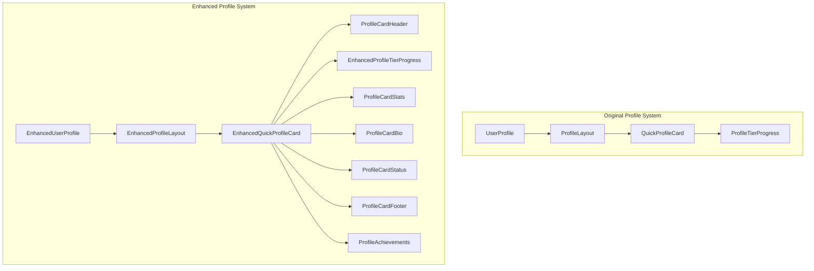

# GoatedVIPs Codebase Redundancy & Optimization Analysis

## Overview

This document provides a comprehensive analysis of redundancy, duplicated logic, and optimization opportunities in the GoatedVIPs codebase. It serves as the foundation for our cleanup and refactoring efforts.

## 1. Profile System Redundancy Analysis

### 1.1 Component Duplication

We've identified parallel implementations of profile components with significant code overlap:

| Original Component | Enhanced Component | Duplication % | Notes |
|-------------------|-------------------|--------------|-------|
| `QuickProfileCard` | `EnhancedQuickProfileCard` | ~80% | Same loading/error handling, similar layout structure |
| `ProfileTierProgress` | `EnhancedProfileTierProgress` | ~70% | Same calculation logic, enhanced styling |
| `ProfileLayout` | `EnhancedProfileLayout` | ~75% | Same core structure, enhanced adds side panel |
| `UserProfile` | `EnhancedUserProfile` | ~90% | Almost identical except component imports |



### 1.2 Specific Function Redundancies

#### Profile Card Loading/Error States

Both `QuickProfileCard` and `EnhancedQuickProfileCard` implement nearly identical loading and error states:

```tsx
// In QuickProfileCard:
if (isLoading) {
  return (
    <motion.div {...fadeIn}>
      <Card className={cn(cardStyles.base, 'p-6 overflow-hidden', className)}>
        <div className="flex h-36 items-center justify-center">
          <Spinner size="lg" className="text-[#D7FF00]" />
        </div>
      </Card>
    </motion.div>
  );
}

// In EnhancedQuickProfileCard - almost identical:
if (isLoading) {
  return (
    <motion.div {...fadeIn}>
      <Card className={cn(cardStyles.base, 'p-6 overflow-hidden', className)}>
        <div className="flex h-36 items-center justify-center">
          <Spinner size="lg" className="text-[#D7FF00]" />
        </div>
      </Card>
    </motion.div>
  );
}
```

#### Profile Ownership Checks

Both profile page implementations use the same ownership check logic:

```tsx
// In UserProfile:
const isOwner = React.useMemo(() => {
  if (!user || !profile) return false;
  return profileService.isProfileOwner(userId);
}, [user, profile, userId]);

// In EnhancedUserProfile - identical:
const isOwner = React.useMemo(() => {
  if (!user || !profile) return false;
  return profileService.isProfileOwner(userId);
}, [user, profile, userId]);
```

### 1.3 Props Interface Inconsistencies

The component props are nearly identical but have subtle differences that could be standardized:

```typescript
// In QuickProfileCard
interface QuickProfileCardProps {
  profileId: string | number;
  onClose?: () => void;
  size?: 'sm' | 'md' | 'lg';
  className?: string;
}

// In EnhancedQuickProfileCard
interface EnhancedQuickProfileCardProps {
  profileId: string | number;
  onClose?: () => void;
  size?: 'sm' | 'md' | 'lg';
  className?: string;
  showAchievements?: boolean; // Only difference
}
```

## 2. Tier System Data Redundancy

### 2.1 Duplicate Tier Definitions

We maintain two separate sources for tier definitions:

#### In tier-utils.ts:

```typescript
export const TIERS: Record<TierLevel, TierInfo> = {
  bronze: {
    name: "Bronze",
    minWager: 1000,
    maxWager: 9999,
    // ...other properties
  },
  silver: {
    name: "Silver",
    minWager: 10000,
    maxWager: 99999,
    // ...other properties
  },
  // ...other tiers
};
```

#### In VipProgram.tsx:

```typescript
const tiers = [
  {
    name: "COPPER",
    icon: "/images/Goated Emblems/copper.548d79cf.svg",
    levels: [{ level: "Copper 1", xpRequired: "0" }],
  },
  {
    name: "BRONZE",
    icon: "/images/Goated Emblems/bronze.e6ea941b.svg",
    levels: [
      { level: "Bronze 1", xpRequired: "1,000" },
      { level: "Bronze 2", xpRequired: "2,000" },
      { level: "Bronze 3", xpRequired: "3,000" },
      { level: "Bronze 4", xpRequired: "4,000" },
    ],
  },
  // ...other tiers
];
```

### 2.2 Inconsistency Risks

This dual definition creates risks of:
- Divergent tier thresholds
- Inconsistent tier naming
- Maintenance overhead when changing tier requirements
- Visual/functional mismatches between VIP program display and user calculations

## 3. Authentication System Redundancies

### 3.1 Token Extraction Logic Duplication

Token extraction logic appears in multiple places:

#### In server/middleware/auth.ts:

```typescript
// Extract token from request (simplified)
const token = req.cookies.token || req.header('Authorization')?.replace('Bearer ', '');
```

#### In server/auth.ts:

```typescript
// Similar extraction logic but slightly different
const token = req.headers.authorization?.split(' ')[1] || req.cookies?.token;
```

### 3.2 Admin Authentication Duplication

Admin authentication occurs in two places:

#### In server/auth.ts (during login):

```typescript
// Admin credential check in auth.ts
if (username === process.env.ADMIN_USERNAME && password === process.env.ADMIN_PASSWORD) {
  // Create admin session
}
```

#### In server/middleware/admin.ts:

```typescript
// Similar admin credential check
if (req.body.username === process.env.ADMIN_USERNAME && req.body.password === process.env.ADMIN_PASSWORD) {
  // Handle admin auth
}
```

### 3.3 Error Message Patterns

Inconsistent error message formats across the authentication system:

```typescript
// In one file
throw new Error("Authentication failed");

// In another file
return res.status(401).json({ message: "Authentication failed" });

// In a third file
throw { code: 401, message: "Authentication failed" };
```

## 4. Route Structure Analysis

### 4.1 Duplicate Profile Routes

Multiple routes pointing to the same component:

```typescript
// In App.tsx:
<Route path="/user-profile/:id" component={UserProfile} />
<Route path="/user/:id" component={UserProfile} />
```

### 4.2 Missing Enhanced Routes

The enhanced profile page isn't integrated with the routing system:

```typescript
// Missing in App.tsx:
// <Route path="/profiles/:id" component={EnhancedUserProfile} />
```

### 4.3 Inconsistent Route Naming

No clear naming convention for routes, mixing:
- `/user-profile/:id`
- `/user/:id`
- Various other formats

## 5. Component Import Patterns

### 5.1 Mixed Import Styles

Inconsistent import patterns throughout the codebase:

```typescript
// Absolute path imports
import { Button } from '@/components/ui/button';

// Relative path imports in the same file
import { ProfileEmblem } from './ProfileEmblem';
```

### 5.2 Component Location Inconsistencies

UI components are spread across different directories:
- `/components/ui/` - For some basic UI components
- `/components/` - For others
- Feature-specific folders but with mixed responsibilities

## 6. Prioritized Optimization Opportunities

Based on our analysis, these are the highest priority optimization opportunities:

### 6.1 Profile System Consolidation

1. **Create unified component interfaces** with feature flags
2. **Consolidate duplicate states** (loading, error, empty)
3. **Standardize prop interfaces** across component pairs
4. **Implement proper route integration** for enhanced components

### 6.2 Tier System Data Centralization

1. **Create a single source of truth** for tier definitions
2. **Support both formats** needed by different components
3. **Validate tier calculations** remain consistent

### 6.3 Authentication Utility Consolidation

1. **Centralize token extraction logic** in auth-utils.ts
2. **Unify admin authentication** methods
3. **Standardize error message patterns**

### 6.4 Route Structure Standardization

1. **Establish consistent route naming conventions**
2. **Implement redirects** from legacy routes
3. **Add proper routes** for enhanced components

## 7. Implementation Recommendations

We recommend a phased implementation approach:

### Phase 1: Component Wrappers & Tier Data (Weeks 1-2)
- Create wrapper components with feature flags
- Implement centralized tier definitions
- Document migration strategy

### Phase 2: Enhanced Component Enabling (Weeks 3-4)
- Begin using enhanced components in non-critical areas
- Add enhanced routes
- Monitor for issues

### Phase 3: Authentication Cleanup & Route Standardization (Weeks 5-6)
- Consolidate auth utilities
- Implement route redirects
- Begin deprecating legacy components

### Phase 4: Final Cleanup (Weeks 7-8)
- Remove legacy components once all references are updated
- Finalize route structure
- Update documentation

## 8. Risk Assessment

### 8.1 User Experience Risks

- Inconsistent UI during transition period
- Potential for breaking changes in profile display

**Mitigation**: Use feature flags to control rollout and enable quick rollback

### 8.2 Technical Risks

- Regression in authentication mechanisms
- Performance impact during transition
- Tier calculation inconsistencies

**Mitigation**: Comprehensive testing strategy and temporary parallel implementations

## 9. Testing Strategy

We recommend the following testing approach:

1. **Unit tests** for individual component functionality
2. **Integration tests** for authentication flows
3. **Visual regression tests** for UI components
4. **End-to-end tests** for critical user journeys

## 10. Conclusion

The current codebase contains significant redundancies, particularly in the profile system and tier data management. By following the recommended consolidation strategy, we can reduce code duplication, improve maintainability, and set a solid foundation for future enhancements while ensuring a smooth transition for users.
