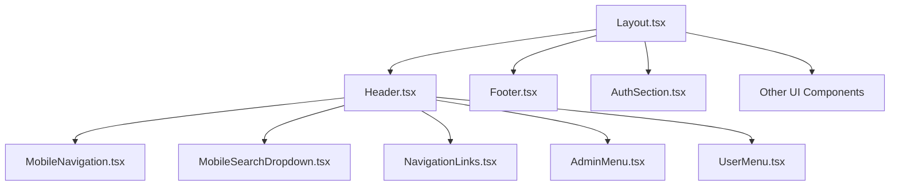

# Layout System Refactoring

## Overview
We've completely refactored the layout system by breaking the monolithic Layout.tsx into smaller, more manageable components with clear responsibilities. This improves code maintainability, performance, and enables better mobile and desktop optimization.

## Architecture Changes

## Key Components

### Layout.tsx
- Now serves as a clean orchestrator component
- Manages global state including authentication
- Handles layout structure but delegates specific UI rendering to subcomponents
- Handles global effects like scroll restoration

### Header.tsx
- Manages navigation for both desktop and mobile
- Coordinates between mobile menu and search components
- Contains utility action buttons and navigation

### MobileNavigation.tsx
- Handles mobile-specific navigation UI and behavior
- Provides a drawer-style menu for mobile devices
- Adapts based on user authentication status

### MobileSearchDropdown.tsx
- Dedicated component for mobile search functionality
- Slides in/out with animations for better UX
- Mobile-optimized input and button sizes

### Footer.tsx
- Responsive grid layout that adapts to screen size
- Optimized for both mobile and desktop viewing
- Uses animations tied to visibility for better performance

## Style Improvements
- Created centralized mobile-specific styles in style-constants.ts
- Added responsive breakpoints for proper component switching
- Consolidated duplicate styles across components
- Created shared style patterns for consistency

## Mobile Optimizations
- Better touch targets for mobile interactions
- Optimized navigation for limited screen space
- Improved animation performance for lower-end devices
- Mobile-first approach for critical components

## Next Steps
- Further refine mobile UX with proper swipe gestures
- Implement lazy loading for non-critical UI components
- Consider adding PWA features for better mobile experience
- Improve accessibility for screen readers and keyboard navigation
