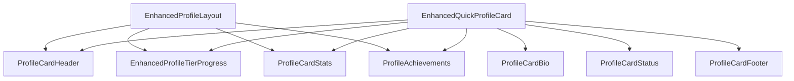

# Profile System Enhancement Documentation

## Overview

We've significantly enhanced the GoatedVIPs profile system with a consice focus on:

1. Component modularity through decomposition
2. Improved visual design with tier-based styling
3. Enhanced user experience with animations and feedback
4. Added gamification elements through achievements
5. Better mobile responsiveness
6. Code maintainability through clear separation of concerns

## Component Hierarchy

The enhanced profile system follows this component hierarchy:



## New Components

### Core Components

1. **EnhancedProfileTierProgress**
   - Replaces the original ProfileTierProgress
   - Adds milestone markers for easier progression tracking
   - Includes a pulsing current position indicator
   - Enhanced tooltip with detailed tier information
   - Tier-based gradient styling and animations

2. **ProfileAchievements**
   - New component for gamification
   - Dynamically generates achievements based on user data
   - Visual indicators for unlocked vs. locked achievements
   - Progress bars for locked achievements
   - Categories: wager, races, loyalty, social

3. **ProfileCardHeader**
   - Tier-based styling with customized backgrounds
   - Enhanced verification badge
   - Improved username and tier display
   - Subtle animation effects

4. **ProfileCardStats**
   - Grid-based layout for key statistics
   - Responsive design for different screen sizes
   - Hover effects for better interactivity
   - Consistent styling with rest of profile components

5. **ProfileCardBio**
   - Stylized display of user's bio text
   - Proper handling of missing bio data
   - Animation entrance effects

6. **ProfileCardStatus**
   - Visual indicators for different account statuses:
     - Verified account
     - Goated account linking status
     - Join date information
   - Conditional rendering based on user context

7. **ProfileCardFooter**
   - Action buttons for profile interaction
   - Proper conditional rendering based on ownership
   - Enhanced primary action button with glow effect

### Container Components

1. **EnhancedQuickProfileCard**
   - Composite component that uses all the above components
   - Proper state handling (loading, error, empty states)
   - Animations and transitions
   - Responsive sizing options (sm, md, lg)

2. **EnhancedProfileLayout**
   - Full profile page layout with responsive design
   - Two-column layout on desktop, single-column on mobile
   - Side panel with tier progress and achievements
   - Main content area for activity feed and other content
   - Enhanced header with tier-based styling
   - Mobile-aware adaptations using media queries

## Key Features & Improvements

### Visual Enhancements

1. **Tier-Based Styling**
   - Each tier (Bronze through Legend) has:
     - Custom gradient background
     - Unique accent colors
     - Custom shadow effects
     - Optional background patterns

2. **Animation Effects**
   - Entrance animations for components
   - Interactive hover effects
   - Progress indicator animations
   - Staggered loading of achievements

3. **Modern UI Techniques**
   - Glass morphism effects on cards
   - Subtle gradients and shadows
   - Consistent color schemes based on tier
   - Improved spacing and layout

### User Experience Improvements

1. **Responsive Design**
   - Mobile-first approach
   - Adaptive layouts for different screen sizes
   - Touch-friendly interactions
   - Improved readability on smaller screens

2. **Enhanced Feedback**
   - Better loading states
   - Improved error handling
   - Interactive elements clearly indicate their state
   - Tooltips for additional information

3. **Gamification Elements**
   - Achievements system for user engagement
   - Progress visualization
   - Milestone tracking
   - Tier-based rewards and incentives

### Code Quality Improvements

1. **Component Decomposition**
   - Single responsibility for each component
   - Clear component boundaries
   - Reusable components
   - Better testability

2. **Consistent Styling**
   - Use of style constants
   - Centralized style definitions
   - Animation presets for consistency
   - Design system approach

3. **Improved Type Safety**
   - Proper TypeScript interfaces
   - Clear prop definitions
   - Type guards for runtime safety
   - Explicit null/undefined handling

4. **Performance Considerations**
   - Memoized calculations
   - Optimized re-renders
   - Code splitting opportunities
   - Lazy loading of components

## Implementation Details

### Tier System Integration

The tier system has been enhanced to include visual elements. The `tier-utils.ts` file now includes:

- Background patterns for each tier
- Accent gradients for visual hierarchy
- Shadow colors for glowing effects
- Animation presets for tier-specific animations

These are applied contextually throughout the profile components.

### Achievement System

The newly added achievement system automatically generates achievements based on user data:

- **Wager-based**: Unlocked when total wagers reach certain thresholds.
- **Race-based**: Tied to race participation and wins.
- **Loyalty-based**: Based on account age.
- **Tier-based**: Unlocked when reaching different tier levels.

The system is designed to be extensible, allowing for easy addition of new achievement types.

## Usage Examples

### Using Enhanced Quick Profile Card

```tsx
// Example: Profile card with tier-based styling and achievements
<EnhancedQuickProfileCard 
  profileId={user.id}
  size="md"
  showAchievements={true}
  onClose={() => setShowProfile(false)}
/>
```

### Using Enhanced Profile Layout

```tsx
// Example: Full profile page with responsive layout
<EnhancedProfileLayout
  profile={profile}
  isOwner={isOwner}
  onEdit={handleEdit}
  onMessage={handleMessage}
  onFollow={handleFollow}
  onShare={handleShare}
  onReport={handleReport}
>
  {/* Main content goes here */}
  <ActivityFeed userId={profile.id} />
</EnhancedProfileLayout>
```

## Integration Requirements

For optimal results, ensure you have:

1. Updated `tier-utils.ts` with the enhanced tier information
2. Added background pattern images to `/public/images/patterns/`
3. Added the additional style constants to `style-constants.ts`
4. Imported the Framer Motion animation presets

## Accessibility Considerations

The enhanced profile system includes several accessibility improvements:

- Proper contrast ratios for text content
- Semantic HTML structure
- Keyboard navigation support
- Screen reader support via ARIA attributes
- Focus management for interactive elements

## Future Enhancements

Potential future improvements:

1. **More Achievement Types**
   - Community contribution achievements
   - Challenge completion achievements
   - Seasonal/limited-time achievements

2. **Advanced Tier Visualization**
   - 3D/parallax effects for tier badges
   - Particle effects for higher tiers
   - Interactive tier exploration

3. **Social Features**
   - Friend/follower counts and display
   - Activity feed improvements
   - Sharing capabilities

4. **Profile Customization**
   - Theme selection
   - Banner image uploads
   - Custom badge positioning
