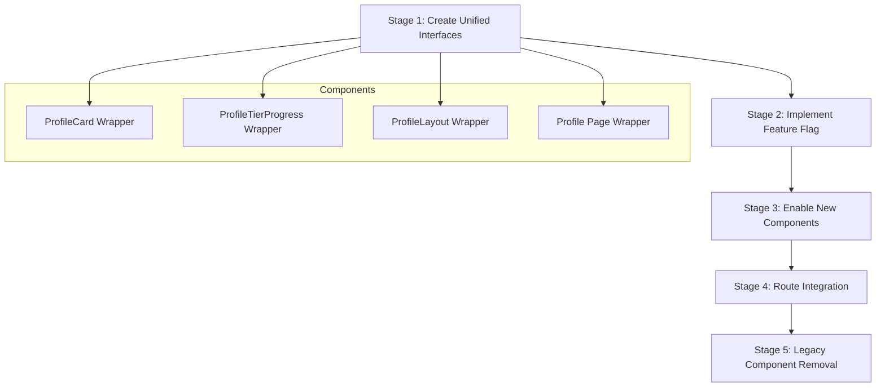

# Profile System Migration Plan

## Overview

This document provides a detailed implementation plan for migrating from our current redundant profile components to a unified, enhanced profile system. This is the highest priority task identified in our codebase redundancy analysis.

## Migration Strategy

We'll use a staged approach with feature flags to ensure a smooth transition:



## Detailed Implementation Steps

### Stage 1: Create Unified Component Interfaces

#### 1.1 Create ProfileCard Wrapper Component

Create a new component that can render either the original or enhanced version:

```typescript
// File: client/src/components/profile/ProfileCard.tsx

import React from 'react';
import { QuickProfileCard } from './QuickProfileCard';
import { EnhancedQuickProfileCard } from './EnhancedQuickProfileCard';

// Base interface for profile card props
export interface ProfileCardBaseProps {
  profileId: string | number;
  onClose?: () => void;
  size?: 'sm' | 'md' | 'lg';
  className?: string;
}

// Extended interface with enhanced features
export interface ProfileCardProps extends ProfileCardBaseProps {
  useEnhanced?: boolean;
  showAchievements?: boolean;
}

/**
 * ProfileCard - A unified component that can render either the original or enhanced version
 * based on a feature flag.
 */
export function ProfileCard({
  profileId,
  onClose,
  size = 'md',
  className,
  useEnhanced = false,
  showAchievements = false,
  ...props
}: ProfileCardProps) {
  if (useEnhanced) {
    return (
      <EnhancedQuickProfileCard
        profileId={profileId}
        onClose={onClose}
        size={size}
        className={className}
        showAchievements={showAchievements}
        {...props}
      />
    );
  }
  
  return (
    <QuickProfileCard
      profileId={profileId}
      onClose={onClose}
      size={size}
      className={className}
      {...props}
    />
  );
}
```

#### 1.2 Create ProfileTierProgress Wrapper Component

Similar wrapper for the tier progress component:

```typescript
// File: client/src/components/profile/TierProgress.tsx

import React from 'react';
import { ProfileTierProgress } from './ProfileTierProgress';
import { EnhancedProfileTierProgress } from './EnhancedProfileTierProgress';
import type { UserProfile } from '@/services/profileService';

export interface TierProgressProps {
  profile: UserProfile;
  className?: string;
  useEnhanced?: boolean;
}

/**
 * TierProgress - A unified component that can render either the original or enhanced
 * tier progress visualization based on a feature flag.
 */
export function TierProgress({
  profile,
  className,
  useEnhanced = false,
}: TierProgressProps) {
  if (useEnhanced) {
    return (
      <EnhancedProfileTierProgress
        profile={profile}
        className={className}
      />
    );
  }
  
  return (
    <ProfileTierProgress
      profile={profile}
      className={className}
    />
  );
}
```

#### 1.3 Create ProfileLayout Wrapper Component

Update the ProfileLayout to conditionally use the enhanced version:

```typescript
// File: client/src/components/profile/ProfileLayout.tsx
// Update the existing component to use a feature flag

import React from 'react';
import { EnhancedProfileLayout } from './EnhancedProfileLayout';
// ... other imports

export interface ProfileLayoutProps {
  profile: UserProfile;
  isOwner: boolean;
  children: React.ReactNode;
  onEdit?: () => void;
  onMessage?: () => void;
  onFollow?: () => void;
  onShare?: () => void;
  onReport?: () => void;
  useEnhanced?: boolean; // New feature flag
}

export function ProfileLayout({
  profile,
  isOwner,
  children,
  onEdit,
  onMessage,
  onFollow,
  onShare,
  onReport,
  useEnhanced = false, // Default to false for backward compatibility
}: ProfileLayoutProps) {
  // If enhanced flag is enabled, use the enhanced layout
  if (useEnhanced) {
    return (
      <EnhancedProfileLayout
        profile={profile}
        isOwner={isOwner}
        onEdit={onEdit}
        onMessage={onMessage}
        onFollow={onFollow}
        onShare={onShare}
        onReport={onReport}
      >
        {children}
      </EnhancedProfileLayout>
    );
  }
  
  // Original implementation remains below
  return (
    // Original ProfileLayout implementation...
  );
}
```

#### 1.4 Create UserProfile Page Wrapper

Create a unified profile page component:

```typescript
// File: client/src/pages/ProfilePage.tsx

import React from 'react';
import { useParams } from 'wouter';
import { UserProfile } from './UserProfile';
import { EnhancedUserProfile } from './EnhancedUserProfile';

// Configuration options - later can be moved to app context or configuration
const PROFILE_CONFIG = {
  useEnhanced: false, // Feature flag
};

/**
 * ProfilePage - A wrapper component that renders either original or enhanced user profile page
 * based on a feature flag.
 */
export function ProfilePage() {
  const params = useParams<{ id: string }>();
  
  if (PROFILE_CONFIG.useEnhanced) {
    return <EnhancedUserProfile />;
  }
  
  return <UserProfile />;
}

export default ProfilePage;
```

### Stage 2: Implement Feature Flag System

Create a centralized feature flag configuration:

```typescript
// File: client/src/config/feature-flags.ts

/**
 * Feature flags to control new component rollout
 */
export const FEATURE_FLAGS = {
  profiles: {
    useEnhancedProfileCard: false,
    useEnhancedTierProgress: false,
    useEnhancedProfileLayout: false,
    useEnhancedProfilePage: false,
  },
  // Other feature flags can be added here
};

// Helper to check if a feature is enabled
export function isFeatureEnabled(featurePath: string): boolean {
  const parts = featurePath.split('.');
  let config: any = FEATURE_FLAGS;
  
  for (const part of parts) {
    if (config[part] === undefined) {
      return false;
    }
    config = config[part];
  }
  
  return Boolean(config);
}
```

### Stage 3: Update References to Use Wrapper Components

#### 3.1 Example: Update Home Page to Use ProfileCard Wrapper

```typescript
// File: client/src/pages/Home.tsx or other files using QuickProfileCard

import { ProfileCard } from '@/components/profile/ProfileCard';
import { isFeatureEnabled } from '@/config/feature-flags';

// Instead of directly importing QuickProfileCard, use the wrapper:
<ProfileCard
  profileId={user.id}
  size="md"
  useEnhanced={isFeatureEnabled('profiles.useEnhancedProfileCard')}
/>
```

#### 3.2 Example: Update User Profile to Use ProfileLayout Wrapper

```typescript
// File: client/src/pages/UserProfile.tsx

import { isFeatureEnabled } from '@/config/feature-flags';

// In the render function:
<ProfileLayout
  profile={profile}
  isOwner={isOwner}
  onEdit={handleEdit}
  onMessage={handleMessage}
  // ... other props
  useEnhanced={isFeatureEnabled('profiles.useEnhancedProfileLayout')}
>
  {/* Content */}
</ProfileLayout>
```

### Stage 4: Implement Route Integration

Update App.tsx to use the unified profile page component:

```typescript
// File: client/src/App.tsx

import ProfilePage from '@/pages/ProfilePage';

// In the Routes configuration:
<Switch>
  {/* ... other routes ... */}
  
  {/* Use unified profile route that handles feature flags internally */}
  <Route path="/profile/:id" component={ProfilePage} />
  
  {/* Keep legacy routes pointing to the unified component */}
  <Route path="/user-profile/:id" component={ProfilePage} />
  <Route path="/user/:id" component={ProfilePage} />
  
  {/* ... other routes ... */}
</Switch>
```

### Stage 5: Gradual Feature Enablement

Plan for gradually enabling features in specific contexts:

1. Start with non-critical areas (profile cards in lists, etc.)
2. Monitor for issues
3. Gradually expand to more visible areas
4. Finally, enable for profile page itself

The feature flags can be updated in `feature-flags.ts`:

```typescript
// Week 1: Enable enhanced profile card in some areas
export const FEATURE_FLAGS = {
  profiles: {
    useEnhancedProfileCard: true, // Enable enhanced card
    useEnhancedTierProgress: false,
    useEnhancedProfileLayout: false,
    useEnhancedProfilePage: false,
  },
};

// Week 2: Enable enhanced tier progress
export const FEATURE_FLAGS = {
  profiles: {
    useEnhancedProfileCard: true,
    useEnhancedTierProgress: true, // Enable enhanced tier progress
    useEnhancedProfileLayout: false,
    useEnhancedProfilePage: false,
  },
};

// And so on for the remaining components
```

## Testing Strategy

Each migration step should be thoroughly tested:

1. **Unit Tests** for the wrapper components to verify they render the correct underlying component based on feature flags
2. **Visual Tests** to ensure the UI appears correctly in both modes
3. **Integration Tests** to validate user journeys work with both component sets
4. **Performance Tests** to ensure no regressions in loading times

## Rollback Plan

If issues are encountered:

1. Disable the problematic feature flag immediately
2. Document the issue, including screenshots and steps to reproduce
3. Fix the issue in the enhanced component
4. Re-enable the feature flag with a more limited scope
5. Monitor closely before expanding again

## Final Stage: Legacy Component Retirement

Once all features have been successfully migrated and stabilized:

1. Deprecate original components with a comment indicating they're being replaced
2. Update documentation to reference only the new components
3. Set all feature flags to 'true' by default
4. Remove feature flags from component props, keeping only the enhanced versions
5. Eventually, remove the legacy components entirely

## Implementation Timeline

| Week | Task | Components | Notes |
|------|------|------------|-------|
| 1    | Create wrapper components | ProfileCard, TierProgress | Focus on component architecture |
| 2    | Create unified profile pages | ProfileLayout, ProfilePage | Complete abstraction layer |
| 3    | Implement feature flags | All | Create config system |
| 4    | Update component references | Home, Profile pages | Replace direct imports |
| 5    | Route integration | App.tsx | Update routing |
| 6    | Enable features (Tier 1) | ProfileCard | Monitor for issues |
| 7    | Enable features (Tier 2) | TierProgress, ProfileLayout | Expand rollout |
| 8    | Enable features (Tier 3) | ProfilePage | Complete migration |

## Conclusion

This phased approach ensures a smooth transition from our current redundant profile components to the enhanced versions, while minimizing risk and maintaining backward compatibility. Using feature flags gives us fine-grained control over the rollout process and allows for quick rollback if issues arise.
