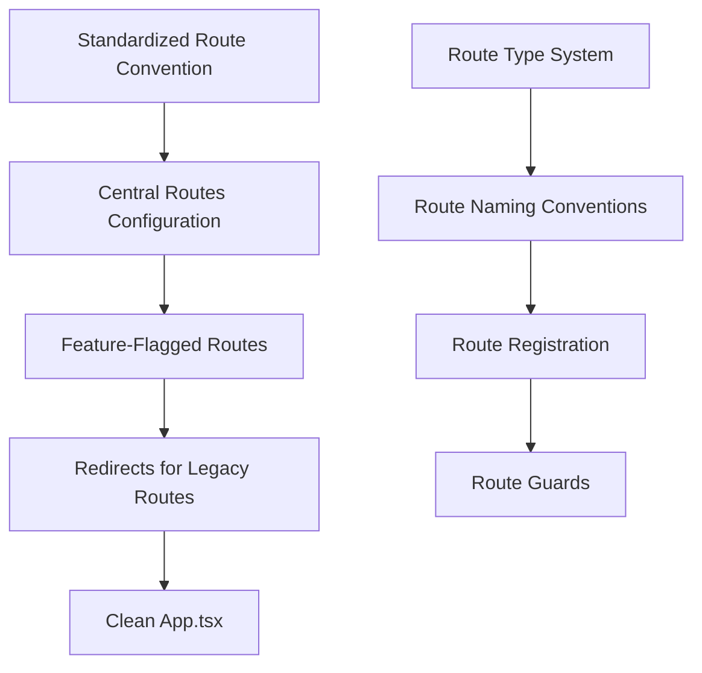

# Route Structure Standardization Plan

## Overview

This document outlines a plan for standardizing route structures throughout the GoatedVIPs platform. Currently, the routing system has inconsistencies, redundancies, and missing integrations for enhanced components. Standardizing our route structure will improve navigation, SEO, maintainability, and user experience.

## Current Issues

### 1. Inconsistent Route Naming

Routes follow different naming conventions:

```typescript
// In App.tsx:
<Route path="/user-profile/:id" component={UserProfile} />
<Route path="/user/:id" component={UserProfile} />
```

### 2. Duplicate Routes

Multiple routes point to the same component:

```typescript
// These both render the same component
<Route path="/user-profile/:id" component={UserProfile} />
<Route path="/user/:id" component={UserProfile} />
```

### 3. Missing Enhanced Component Routes

Enhanced components exist but aren't properly integrated with the routing system:

```typescript
// Missing in App.tsx:
// <Route path="/profiles/:id" component={EnhancedUserProfile} />
```

### 4. Inconsistent Route Parameter Handling

Different patterns for route parameters:

```typescript
// Some routes use IDs directly
<Route path="/user/:id" component={UserProfile} />

// While others might use more specific parameters
<Route path="/race/:raceId" component={RaceDetails} />
```

## Proposed Solution

Implement a standardized routing system with clear conventions, proper redirects, and feature flag support.



## Implementation Steps

### Step 1: Define Route Naming Conventions

Establish consistent naming conventions:

| Resource Type | URL Pattern | Example |
|---------------|-------------|---------|
| User profiles | `/profiles/:id` | `/profiles/123` |
| User pages | `/users/:username` | `/users/johndoe` |
| Features | `/features/:featureId` | `/features/races` |
| Admin | `/admin/:resource` | `/admin/users` |
| Account | `/account/:section` | `/account/settings` |

### Step 2: Create Centralized Routes Configuration

Create a central routes definition file:

```typescript
// File: client/src/config/routes.ts

/**
 * Centralized route configuration
 * This serves as the single source of truth for all application routes
 */

export type RouteConfig = {
  path: string;
  component: React.ComponentType<any>;
  exact?: boolean;
  isProtected?: boolean;
  isAdmin?: boolean;
  title?: string;
  featureFlag?: string;
  redirects?: string[]; // Legacy paths that redirect to this route
};

/**
 * Application routes configuration
 */
export const ROUTES: Record<string, RouteConfig> = {
  // Home
  home: {
    path: '/',
    component: React.lazy(() => import('@/pages/Home')),
    exact: true,
    title: 'Home',
  },
  
  // Profile routes
  userProfile: {
    path: '/profiles/:id',
    component: React.lazy(() => import('@/pages/ProfilePage')),
    title: 'User Profile',
    redirects: ['/user-profile/:id', '/user/:id'],
  },
  
  // Account
  accountSettings: {
    path: '/account/settings',
    component: React.lazy(() => import('@/pages/AccountSettings')),
    isProtected: true,
    title: 'Account Settings',
  },
  
  // Admin
  adminDashboard: {
    path: '/admin',
    component: React.lazy(() => import('@/pages/admin/Dashboard')),
    exact: true,
    isProtected: true,
    isAdmin: true,
    title: 'Admin Dashboard',
  },
  
  // Feature pages
  vipProgram: {
    path: '/vip',
    component: React.lazy(() => import('@/pages/VipProgram')),
    title: 'VIP Program',
  },
  
  // Other routes...
};

/**
 * Get a route path by its key
 */
export function getRoutePath(key: keyof typeof ROUTES): string {
  return ROUTES[key].path;
}

/**
 * Generate route path with params
 */
export function generatePath(key: keyof typeof ROUTES, params: Record<string, string | number>): string {
  let path = getRoutePath(key);
  
  Object.keys(params).forEach(paramKey => {
    path = path.replace(`:${paramKey}`, params[paramKey].toString());
  });
  
  return path;
}
```

### Step 3: Create App Router Component

Create a component that renders routes based on configuration:

```typescript
// File: client/src/components/AppRouter.tsx

import React, { Suspense } from 'react';
import { Switch, Route, Redirect } from 'wouter';
import { ROUTES } from '@/config/routes';
import { useAuth } from '@/hooks/use-auth';
import { isFeatureEnabled } from '@/config/feature-flags';
import { PageLoader } from '@/components/PageLoader';

// Redirect component for legacy routes
const LegacyRouteRedirect = ({ legacyPath, targetPath }: { legacyPath: string; targetPath: string }) => {
  return (
    <Route 
      path={legacyPath} 
      component={() => {
        // Extract params from the current URL
        // For simplicity, this example just redirects without preserving params
        // In a real implementation, we would need to extract and map params
        return <Redirect to={targetPath} />;
      }} 
    />
  );
};

// Protected route component
const ProtectedRoute = ({ component: Component, isAdmin, ...rest }: any) => {
  const { user, isLoading } = useAuth();
  
  if (isLoading) {
    return <PageLoader />;
  }
  
  return (
    <Route
      {...rest}
      component={(props: any) => {
        if (!user) {
          // Redirect to login page
          return <Redirect to="/login" />;
        }
        
        if (isAdmin && !user.isAdmin) {
          // Redirect to unauthorized page
          return <Redirect to="/unauthorized" />;
        }
        
        return <Component {...props} />;
      }}
    />
  );
};

export function AppRouter() {
  return (
    <Suspense fallback={<PageLoader />}>
      <Switch>
        {/* Render main routes */}
        {Object.entries(ROUTES).map(([key, route]) => {
          // Skip if feature flag is specified and not enabled
          if (route.featureFlag && !isFeatureEnabled(route.featureFlag)) {
            return null;
          }
          
          // Create appropriate route type based on config
          if (route.isProtected) {
            return (
              <ProtectedRoute
                key={key}
                path={route.path}
                component={route.component}
                exact={route.exact}
                isAdmin={route.isAdmin}
              />
            );
          }
          
          return (
            <Route
              key={key}
              path={route.path}
              component={route.component}
              exact={route.exact}
            />
          );
        })}
        
        {/* Create redirects for legacy routes */}
        {Object.values(ROUTES).flatMap(route => 
          (route.redirects || []).map((legacyPath, idx) => (
            <LegacyRouteRedirect 
              key={`${route.path}-redirect-${idx}`}
              legacyPath={legacyPath}
              targetPath={route.path}
            />
          ))
        )}
        
        {/* 404 route */}
        <Route component={() => <Redirect to="/not-found" />} />
      </Switch>
    </Suspense>
  );
}

export default AppRouter;
```

### Step 4: Update App.tsx to Use AppRouter

Simplify the main App component:

```typescript
// File: client/src/App.tsx

import React from 'react';
import { AppRouter } from '@/components/AppRouter';
import { AuthProvider } from '@/contexts/AuthContext';
import { ThemeProvider } from '@/contexts/ThemeContext';
import { Toaster } from '@/components/ui/toaster';

function App() {
  return (
    <ThemeProvider>
      <AuthProvider>
        <AppRouter />
        <Toaster />
      </AuthProvider>
    </ThemeProvider>
  );
}

export default App;
```

### Step 5: Create Route Link Component

Create a typed component for generating links:

```typescript
// File: client/src/components/RouteLink.tsx

import React from 'react';
import { Link } from 'wouter';
import { ROUTES, generatePath } from '@/config/routes';

interface RouteLinkProps {
  to: keyof typeof ROUTES;
  params?: Record<string, string | number>;
  children: React.ReactNode;
  className?: string;
  onClick?: () => void;
}

export function RouteLink({ 
  to, 
  params = {}, 
  children, 
  className,
  onClick,
  ...props 
}: RouteLinkProps) {
  // Generate the full path with parameters
  const path = generatePath(to, params);
  
  return (
    <Link href={path} className={className} onClick={onClick} {...props}>
      {children}
    </Link>
  );
}

export default RouteLink;
```

### Step 6: Create Route Navigation Utility

Create utility functions for programmatic navigation:

```typescript
// File: client/src/utils/navigation.ts

import { ROUTES, generatePath } from '@/config/routes';

/**
 * Navigate to a named route with parameters
 */
export function navigateTo(
  routeKey: keyof typeof ROUTES,
  params: Record<string, string | number> = {},
  options: { replace?: boolean } = {}
): void {
  const path = generatePath(routeKey, params);
  
  if (options.replace) {
    window.location.replace(path);
  } else {
    window.location.href = path;
  }
}

/**
 * Generate a full URL (including domain) for a route
 */
export function getFullUrl(
  routeKey: keyof typeof ROUTES,
  params: Record<string, string | number> = {}
): string {
  const path = generatePath(routeKey, params);
  return `${window.location.origin}${path}`;
}

/**
 * Share a route via the Web Share API if available
 */
export async function shareRoute(
  routeKey: keyof typeof ROUTES,
  params: Record<string, string | number> = {},
  shareData: { title?: string; text?: string } = {}
): Promise<boolean> {
  const url = getFullUrl(routeKey, params);
  
  if (navigator.share) {
    try {
      await navigator.share({
        url,
        title: shareData.title || document.title,
        text: shareData.text,
      });
      return true;
    } catch (error) {
      console.error('Error sharing:', error);
      return false;
    }
  }
  
  // Fallback - copy to clipboard
  try {
    await navigator.clipboard.writeText(url);
    return true;
  } catch (error) {
    console.error('Error copying to clipboard:', error);
    return false;
  }
}
```

### Step 7: Update Profile Components with New Route Structure

Update profile components to use the new route structure:

```typescript
// In client/src/components/profile/QuickProfileCard.tsx or any component with profile links

import { RouteLink } from '@/components/RouteLink';

// Replace:
<Link href={`/user-profile/${profile.id}`}>
  <Button>View Profile</Button>
</Link>

// With:
<RouteLink to="userProfile" params={{ id: profile.id }}>
  <Button>View Profile</Button>
</RouteLink>
```

### Step 8: Create & Update Route Navigation Guards

Implement route guards for protected routes:

```typescript
// File: client/src/hooks/use-route-guard.ts

import { useEffect } from 'react';
import { useLocation } from 'wouter';
import { useAuth } from '@/hooks/use-auth';
import { ROUTES } from '@/config/routes';

/**
 * Hook to guard routes based on authentication state
 */
export function useRouteGuard(
  isProtected: boolean = false,
  isAdmin: boolean = false
) {
  const { user, isLoading } = useAuth();
  const [, navigate] = useLocation();
  
  useEffect(() => {
    if (isLoading) {
      return; // Wait for auth to load
    }
    
    if (isProtected && !user) {
      navigate('/login');
      return;
    }
    
    if (isAdmin && (!user || !user.isAdmin)) {
      navigate('/unauthorized');
      return;
    }
  }, [user, isLoading, isProtected, isAdmin, navigate]);
  
  return { isLoading };
}

/**
 * Higher-order component to wrap protected routes
 */
export function withRouteGuard(
  Component: React.ComponentType<any>,
  options: { isProtected?: boolean; isAdmin?: boolean } = {}
) {
  return (props: any) => {
    const { isLoading } = useRouteGuard(
      options.isProtected,
      options.isAdmin
    );
    
    if (isLoading) {
      return <div>Loading...</div>; // Or a proper loader component
    }
    
    return <Component {...props} />;
  };
}
```

## Testing Strategy

### Route Structure Tests

Create tests to verify the routing system:

```typescript
// File: client/src/config/routes.test.ts

import { ROUTES, generatePath } from './routes';

describe('Routes Configuration', () => {
  test('all routes have valid paths', () => {
    Object.entries(ROUTES).forEach(([key, route]) => {
      expect(route.path).toBeDefined();
      expect(route.path.startsWith('/')).toBe(true);
    });
  });
  
  test('generatePath correctly replaces path parameters', () => {
    const path = generatePath('userProfile', { id: 123 });
    expect(path).toBe('/profiles/123');
  });
  
  test('routes with redirects contain valid paths', () => {
    Object.values(ROUTES)
      .filter(route => route.redirects && route.redirects.length > 0)
      .forEach(route => {
        route.redirects!.forEach(redirectPath => {
          expect(redirectPath.startsWith('/')).toBe(true);
        });
      });
  });
});
```

### End-to-End Navigation Tests

Create end-to-end tests for critical navigation paths:

```typescript
// File: cypress/integration/navigation.spec.ts

describe('Navigation', () => {
  before(() => {
    // Login for protected route tests
    cy.login();
  });

  it('navigates to user profile and back', () => {
    cy.visit('/');
    cy.contains('User Profile').click();
    cy.url().should('include', '/profiles/');
    cy.contains('Back to Home').click();
    cy.url().should('eq', Cypress.config().baseUrl + '/');
  });
  
  it('redirects from legacy route to new route', () => {
    cy.visit('/user/123');
    cy.url().should('include', '/profiles/123');
  });
  
  it('protects admin routes from unauthorized access', () => {
    // Logout first
    cy.logout();
    
    // Try to visit admin route
    cy.visit('/admin');
    
    // Should be redirected to login
    cy.url().should('include', '/login');
  });
});
```

## Implementation Timeline

| Week | Task | Description |
|------|------|-------------|
| 1    | Define route naming conventions | Establish standards and conventions |
| 1    | Create central routes configuration | Implement `routes.ts` file |
| 2    | Create AppRouter component | Build route rendering system |
| 2    | Update App.tsx | Replace manual routes with AppRouter |
| 3    | Create RouteLink component | Implement typed link component |
| 3    | Create navigation utilities | Build programmatic navigation tools |
| 4    | Update components to use new routes | Update profile and other components |
| 4    | Implement route guards | Add protection for sensitive routes |
| 5    | Write tests | Test route structure and navigation |
| 5    | Deploy changes | Release route structure improvements |

## Risk Assessment & Mitigation

### 1. SEO Impact

**Risk**: Changing URLs could negatively impact SEO if not handled carefully.

**Mitigation**:
- Implement proper 301 redirects from old routes to new routes
- Update sitemaps with new URL structure
- Monitor search rankings during transition

### 2. Broken External Links

**Risk**: External sites may have linked to our old URL structure.

**Mitigation**:
- Keep legacy route redirects in place permanently
- Monitor 404 errors and add additional redirects as needed

### 3. User Bookmarks

**Risk**: Users may have bookmarked pages with the old URL structure.

**Mitigation**:
- Implement redirects that preserve route parameters
- Consider notifying users about URL changes via a site banner

## Conclusion

This route structure standardization plan will significantly improve the maintainability and consistency of our codebase's routing system. By centralizing route definitions, implementing proper redirects, and creating standardized navigation utilities, we'll make the codebase more maintainable and provide a better developer experience for future enhancements.
