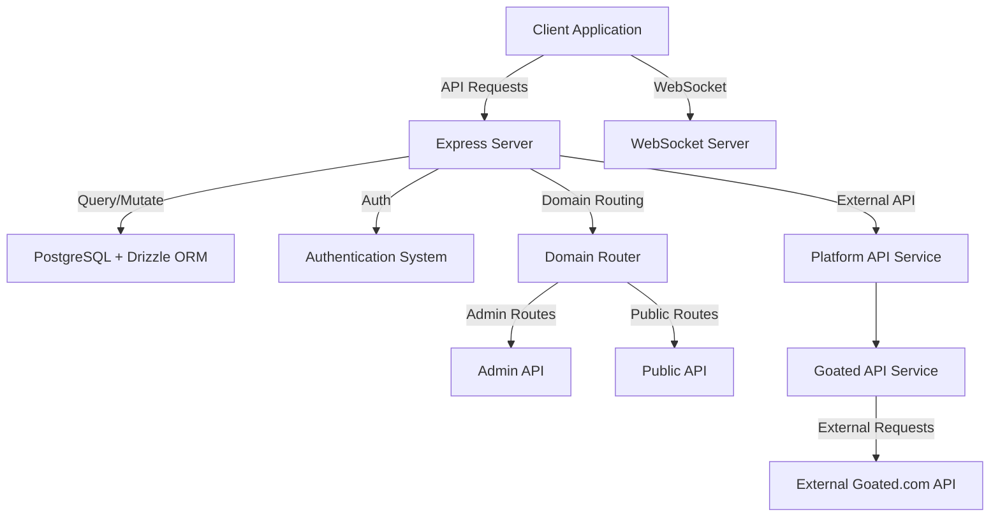
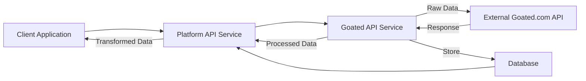
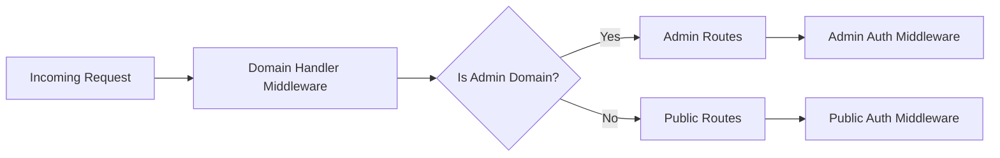
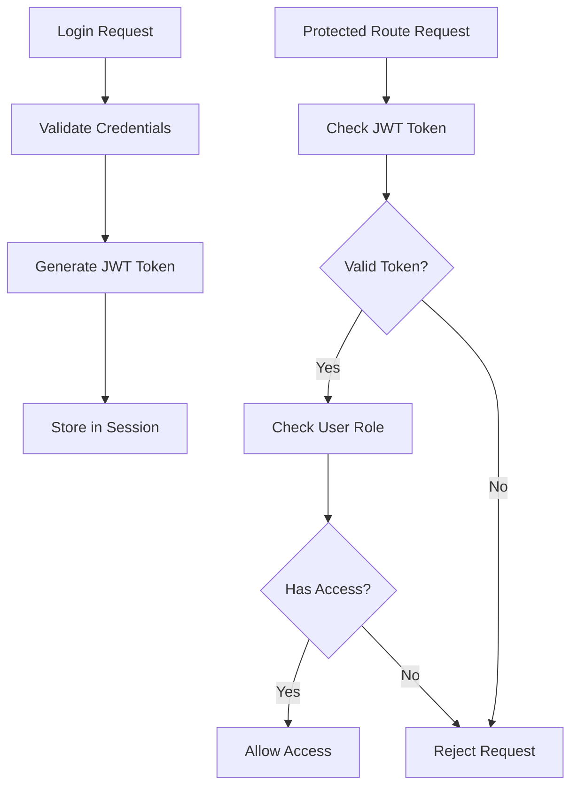
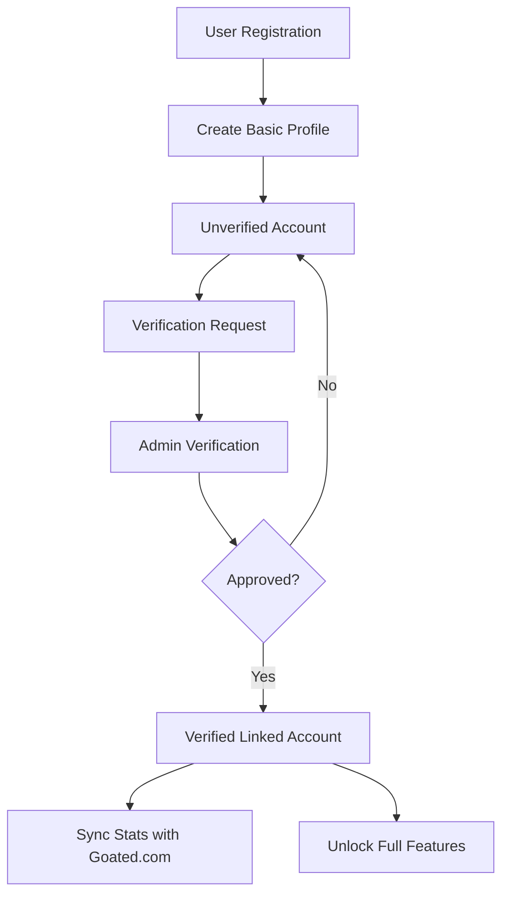
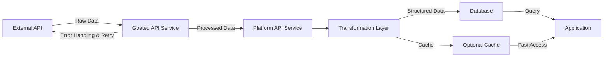
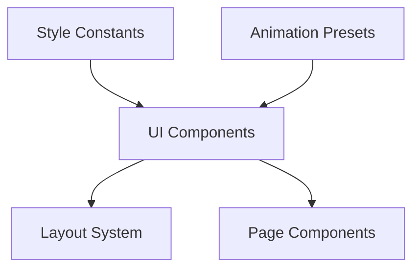

# GoatedVIPs System Patterns

## Architecture Overview

The GoatedVIPs platform follows a modern full-stack architecture with the following key components:



## API Service Architecture Pattern

The platform implements a two-service architecture pattern for handling API communication:



### Implementation:
- `goatedApiService.ts`: Handles external API communication with retry logic and error handling
- `platformApiService.ts`: Provides internal API endpoints and transforms data for client consumption
- `apiRoutes.ts`: Routes API requests to the appropriate service methods
- `dataSyncTasks.ts`: Scheduled synchronization of data from external API

## Domain-Based Routing Pattern

The platform implements a domain-specific routing pattern that directs traffic based on the incoming hostname:



### Implementation:
- `domain-handler.ts`: Middleware that identifies the domain and sets request properties
- `domain-router.ts`: Routes requests to appropriate handlers based on domain
- Client-side domain detection via `domain-utils.ts`

## Authentication & Authorization Pattern

The platform uses a JWT-based authentication system with role-based authorization:



### Implementation:
- JWT generation and verification in `auth.ts`
- Protected route components for React routing
- Admin-specific route protection with domain validation

## User Profile & Verification Pattern

The platform implements a verification system to link Goated.com accounts with platform profiles:



### Implementation:
- Verification requests stored in database
- Admin approval workflow
- Email verification system
- Profile types based on verification status

## Data Transformation Pattern

The platform synchronizes data with external APIs and transforms it for internal use:



### Implementation:
- External API access via `goatedApiService.ts`
- Data transformation in `platformApiService.ts`
- Data synchronization scheduled through `dataSyncTasks.ts`
- Database schema designed for efficient querying

## Component Patterns

### Frontend Component Architecture
- Container/Presentation pattern for complex components
- Custom hooks for shared logic and state management
- Context API for global state (authentication, theme)

### Backend Service Architecture
- Route handler -> Service -> Database access pattern
- Middleware for cross-cutting concerns
- Error handling standardization

## Security Patterns

### Authentication Security
- JWT with proper expiration
- HTTP-only cookies for token storage
- CSRF protection

### Admin Security
- Domain-specific access controls
- Enhanced security headers for admin domain
- Environment variable-based credentials

### API Security
- Input validation with Zod schemas
- Rate limiting for sensitive endpoints
- CORS configuration based on domain

## UI Patterns

### Style & Animation System



### Style Constants Pattern
Centralized Tailwind class combinations in `style-constants.ts` grouped by component type:

```typescript
export const containerStyles = {
  page: "container mx-auto px-4 sm:px-6 lg:px-8 max-w-7xl",
  content: "container mx-auto px-4 max-w-5xl"
};

export const cardStyles = {
  base: "relative p-4 md:p-6 lg:p-8 rounded-xl border-[...]",
  interactive: "transform transition-all duration-300 hover:scale-[1.02]"
};
```

### Animation Presets Pattern
Reusable Framer Motion animations in `animation-presets.ts`:

```typescript
export const fadeInUp: MotionProps = {
  initial: { opacity: 0, y: 20 },
  animate: { opacity: 1, y: 0 },
  transition: { duration: 0.3 }
};

// Used with components:
<motion.div
  {...fadeInUp}
  transition={{ ...fadeInUp.transition, delay: 0.3 }}
>
  Content
</motion.div>
```

### Component Interface Pattern
TypeScript interfaces for all component props:

```typescript
interface NavLinkProps {
  href: string;
  label: string | React.ReactNode;
  tooltip?: string;
  externalLink?: boolean;
}

function NavLink({ href, label, tooltip, externalLink = false }: NavLinkProps) {
  // Component implementation
}
```

### Accessibility Pattern
ARIA attributes and semantic HTML:

```jsx
<nav role="navigation" aria-label="Main Navigation">
  <div role="menubar" aria-label="Desktop Menu">
    <div role="menuitem" aria-current="page">
      Home
    </div>
  </div>
</nav>
```

### Responsive Design Pattern
Mobile-first approach with tailored experiences:

```jsx
<div className="w-full md:w-1/2 lg:w-1/3 p-4">
  <div className="hidden md:block">
    <DesktopComponent />
  </div>
  <div className="md:hidden">
    <MobileComponent />
  </div>
</div>
```
