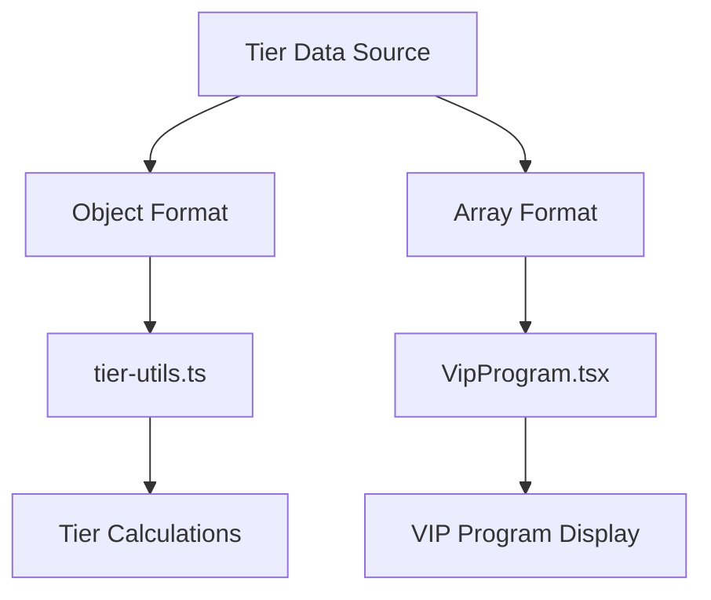

# Tier System Data Consolidation Plan

## Overview

This document outlines the implementation plan for consolidating the duplicate tier system data sources in the GoatedVIPs codebase. Currently, tier data exists in two separate places:

1. `tier-utils.ts` - Contains the `TIERS` object with detailed tier information for calculations
2. `VipProgram.tsx` - Contains the `tiers` array used for displaying VIP program information

Having these two separate data structures creates risks of inconsistency and increases maintenance overhead.

## Current Issues

### Different Data Structure Formats

#### In tier-utils.ts:
```typescript
export const TIERS: Record<TierLevel, TierInfo> = {
  bronze: {
    name: "Bronze",
    color: "text-amber-600",
    colorClass: "amber",
    hexColor: "#D97706",
    icon: TrendingUp,
    minWager: 1000, // Bronze 1
    maxWager: 9999,
    benefits: [
      "Instant Rakeback",
      "Level Up Bonus",
      "Weekly Bonus"
    ],
    // Additional properties...
  },
  // Other tiers...
};
```

#### In VipProgram.tsx:
```typescript
const tiers = [
  {
    name: "COPPER",
    icon: "/images/Goated Emblems/copper.548d79cf.svg",
    levels: [{ level: "Copper 1", xpRequired: "0" }],
  },
  {
    name: "BRONZE",
    icon: "/images/Goated Emblems/bronze.e6ea941b.svg",
    levels: [
      { level: "Bronze 1", xpRequired: "1,000" },
      { level: "Bronze 2", xpRequired: "2,000" },
      { level: "Bronze 3", xpRequired: "3,000" },
      { level: "Bronze 4", xpRequired: "4,000" },
    ],
  },
  // Other tiers...
];
```

### Inconsistency Risks

1. Different tier thresholds between display and calculations
2. Inconsistent naming conventions (e.g., "BRONZE" vs "Bronze")
3. Maintenance overhead when updates are needed
4. Potential mismatch between displayed benefits and actual calculations

## Proposed Solution

Create a centralized tier data definition that can be exported in multiple formats to meet the needs of different components:



## Implementation Steps

### Step 1: Create a Centralized Tier Data Definition

Create a new file at `client/src/data/tier-definitions.ts`:

```typescript
/**
 * Centralized tier data definitions for the GoatedVIPs platform
 * 
 * This file serves as the single source of truth for all tier-related data
 * including thresholds, benefits, visual attributes, and level definitions.
 */

import { 
  TrendingUp, 
  Award, 
  Crown, 
  Diamond, 
  Star, 
  Zap, 
  Trophy 
} from "lucide-react";

// Types for level structure
export interface TierLevel {
  level: string;
  xpRequired: string;
  numericXpRequired: number; // Added for calculations
}

// Full tier definition structure
export interface TierDefinition {
  key: string;           // Lowercase key for object mapping (e.g., "bronze")
  name: string;          // Display name (e.g., "BRONZE" or "Bronze")
  color: string;         // Text color class
  colorClass: string;    // Base color name for Tailwind
  hexColor: string;      // Hex color code
  icon: typeof TrendingUp | string; // Either component or image path
  iconPath: string;      // Path to the tier emblem image
  minWager: number;      // Minimum wager for this tier
  maxWager: number | null; // Maximum wager for this tier (or null for highest tier)
  benefits: string[];    // List of benefits this tier provides
  levels: TierLevel[];   // Array of levels within this tier
  
  // Optional visual enhancement properties
  glassGradient?: string;
  backgroundPattern?: string;
  accentGradient?: string;
  animationPreset?: string;
  shadowColor?: string;
}

/**
 * The master tier definitions array containing all tier data
 */
export const TIER_DEFINITIONS: TierDefinition[] = [
  {
    key: "copper",
    name: "COPPER",
    color: "text-amber-900",
    colorClass: "amber",
    hexColor: "#78350F",
    icon: TrendingUp,
    iconPath: "/images/Goated Emblems/copper.548d79cf.svg",
    minWager: 0,
    maxWager: 999,
    benefits: [],
    levels: [
      { level: "Copper 1", xpRequired: "0", numericXpRequired: 0 }
    ],
    glassGradient: "linear-gradient(135deg, rgba(120, 53, 15, 0.15), rgba(120, 53, 15, 0.1))",
    backgroundPattern: "/images/patterns/copper-pattern.svg",
    accentGradient: "linear-gradient(135deg, #78350F, #92400E)",
    animationPreset: "copper",
    shadowColor: "rgba(120, 53, 15, 0.5)"
  },
  {
    key: "bronze",
    name: "BRONZE",
    color: "text-amber-600",
    colorClass: "amber",
    hexColor: "#D97706",
    icon: TrendingUp,
    iconPath: "/images/Goated Emblems/bronze.e6ea941b.svg",
    minWager: 1000,
    maxWager: 9999,
    benefits: [
      "Instant Rakeback",
      "Level Up Bonus",
      "Weekly Bonus"
    ],
    levels: [
      { level: "Bronze 1", xpRequired: "1,000", numericXpRequired: 1000 },
      { level: "Bronze 2", xpRequired: "2,000", numericXpRequired: 2000 },
      { level: "Bronze 3", xpRequired: "3,000", numericXpRequired: 3000 },
      { level: "Bronze 4", xpRequired: "4,000", numericXpRequired: 4000 }
    ],
    glassGradient: "linear-gradient(135deg, rgba(217, 119, 6, 0.15), rgba(180, 83, 9, 0.1))",
    backgroundPattern: "/images/patterns/bronze-pattern.svg",
    accentGradient: "linear-gradient(135deg, #D97706, #92400E)",
    animationPreset: "bronze",
    shadowColor: "rgba(217, 119, 6, 0.5)"
  },
  // Add other tiers following the same structure...
  // ...
];

/**
 * Creates an object-based tier mapping for tier-utils.ts compatibility
 * Maps tier keys to their definitions for quick lookup
 */
export const TIERS_BY_KEY: Record<string, TierDefinition> = TIER_DEFINITIONS.reduce((acc, tier) => {
  acc[tier.key] = tier;
  return acc;
}, {} as Record<string, TierDefinition>);

/**
 * Returns the array format needed for VipProgram.tsx
 * This maintains compatibility with the existing component
 */
export const TIERS_ARRAY = TIER_DEFINITIONS.map(tier => ({
  name: tier.name,
  icon: tier.iconPath,
  levels: tier.levels.map(level => ({
    level: level.level,
    xpRequired: level.xpRequired
  }))
}));

/**
 * Helper functions
 */

/**
 * Get tier info by tier key
 */
export function getTierByKey(key: string): TierDefinition | undefined {
  return TIERS_BY_KEY[key];
}

/**
 * Get tier based on wager amount
 */
export function getTierFromWager(totalWager: number): TierDefinition {
  for (let i = TIER_DEFINITIONS.length - 1; i >= 0; i--) {
    if (totalWager >= TIER_DEFINITIONS[i].minWager) {
      return TIER_DEFINITIONS[i];
    }
  }
  // Default to lowest tier
  return TIER_DEFINITIONS[0];
}

/**
 * Get tier key based on wager amount
 */
export function getTierKeyFromWager(totalWager: number): string {
  return getTierFromWager(totalWager).key;
}

/**
 * Function to get next tier info
 */
export function getNextTierInfo(currentTier: string | number): TierDefinition | null {
  // If passed a number (totalWager), convert to tier
  const tier = typeof currentTier === 'number' 
    ? getTierFromWager(currentTier) 
    : TIERS_BY_KEY[currentTier];
    
  if (!tier) return null;
  
  // Find current tier index
  const currentIndex = TIER_DEFINITIONS.findIndex(t => t.key === tier.key);
  
  // If highest tier or not found, return null
  if (currentIndex === -1 || currentIndex === TIER_DEFINITIONS.length - 1) {
    return null;
  }
  
  // Return next tier
  return TIER_DEFINITIONS[currentIndex + 1];
}
```

### Step 2: Update tier-utils.ts

Refactor `tier-utils.ts` to import from the centralized definition:

```typescript
// File: client/src/lib/tier-utils.ts

// Replace existing TIERS definition with import
import { 
  TIERS_BY_KEY as TIERS, 
  getTierFromWager,
  getTierKeyFromWager,
  getNextTierInfo
} from '@/data/tier-definitions';

// Re-export types
export type { TierDefinition, TierLevel } from '@/data/tier-definitions';

// Keep type compatibility with existing code
export type TierLevel = 
  | "bronze" 
  | "silver" 
  | "gold" 
  | "platinum" 
  | "diamond" 
  | "master" 
  | "legend";

// Map legacy TierInfo type to new TierDefinition type
export interface TierInfo {
  name: string;
  color: string;
  colorClass: string;
  hexColor: string;
  icon: typeof TrendingUp;
  minWager: number;
  maxWager: number | null;
  benefits: string[];
  glassGradient?: string;
  backgroundPattern?: string;
  accentGradient?: string;
  animationPreset?: string;
  nextMilestone?: number;
  shadowColor?: string;
}

// Re-export existing functions for backward compatibility,
// but internally they'll use the new data source
export { getTierFromWager, getNextTierInfo };

/**
 * Calculate the progress to the next tier
 * 
 * @param totalWager - User's total wager amount
 * @returns Progress percentage (0-1)
 */
export function getNextTierProgress(totalWager: number): number {
  const currentTierKey = getTierKeyFromWager(totalWager);
  const currentTier = TIERS[currentTierKey];
  
  // If already at highest tier, return 1 (100%)
  if (!getNextTierInfo(currentTierKey)) {
    return 1;
  }
  
  const nextTier = getNextTierInfo(currentTierKey)!;
  
  // Calculate progress within the current tier
  const progressInTier = totalWager - currentTier.minWager;
  const tierRange = nextTier.minWager - currentTier.minWager;
  
  return Math.min(progressInTier / tierRange, 1);
}

/**
 * Calculate the progress percentage to the next tier
 * 
 * @param totalWager - User's total wager amount
 * @returns Progress percentage (0-100)
 */
export function getTierProgressPercentage(totalWager: number): number {
  return Math.floor(getNextTierProgress(totalWager) * 100);
}

// Add the remaining utility functions that were originally in tier-utils.ts
// but make them use the new data source
// ...
```

### Step 3: Update VipProgram.tsx

Refactor `VipProgram.tsx` to use the centralized tier data:

```typescript
// File: client/src/pages/VipProgram.tsx

import { motion } from "framer-motion";
import { ArrowLeft } from "lucide-react";
import { ChevronDown } from "lucide-react";
import { useState } from "react";
// Import the array format directly
import { TIERS_ARRAY as tiers } from '@/data/tier-definitions';
import { PageTransition } from "@/components/PageTransition";

// The benefits array can also be moved to tier-definitions.ts
// and imported here, or kept inline if it's only used in this component
const benefits = [
  { name: "Instant Rakeback", startingTier: "BRONZE" },
  { name: "Level Up Bonus", startingTier: "BRONZE" },
  { name: "Weekly Bonus", startingTier: "BRONZE" },
  { name: "Monthly Bonus", startingTier: "SILVER" },
  { name: "Bonus Increase", startingTier: "SILVER" },
  { name: "Referral Increase", startingTier: "GOLD" },
  { name: "Loss Back Bonus", startingTier: "GOLD" },
  { name: "VIP Host", startingTier: "PEARL" },
  { name: "Goated Event Invitations", startingTier: "EMERALD" },
];

export default function VipProgram() {
  // Rest of the component remains unchanged
  const [expandedTier, setExpandedTier] = useState<string | null>(null);

  return (
    // Component JSX...
  );
}
```

### Step 4: Validate Tier Calculations

Create a validation script to ensure that both systems produce the same results:

```typescript
// File: client/src/utils/tier-validation.ts

import { TIERS_BY_KEY, getTierFromWager } from '@/data/tier-definitions';

/**
 * Validation utility to ensure consistent tier calculations
 * This can be executed during development or in tests
 */
export function validateTierCalculations() {
  // Test wager amounts
  const testAmounts = [
    0,        // Copper
    500,      // Copper
    1000,     // Bronze 1
    2000,     // Bronze 2
    10000,    // Silver 1
    100000,   // Gold 1
    450000,   // Platinum 1
    1500000,  // Pearl/Diamond 1
    3000000,  // Sapphire/Master 1
    7000000,  // Emerald/Legend 1
    50000000  // Highest tier
  ];
  
  console.log("=== TIER CALCULATION VALIDATION ===");
  
  // Validate tier for each test amount
  testAmounts.forEach(amount => {
    const tier = getTierFromWager(amount);
    console.log(`Wager Amount: $${amount.toLocaleString()}`);
    console.log(`  Tier: ${tier.name}`);
    console.log(`  Min Wager: $${tier.minWager.toLocaleString()}`);
    
    // Find corresponding level
    const level = tier.levels.find(l => amount >= l.numericXpRequired) || tier.levels[0];
    console.log(`  Level: ${level.level}`);
    console.log(`  XP Required: ${level.xpRequired}`);
    console.log("---");
  });
  
  console.log("=== VALIDATION COMPLETE ===");
}

// Export default for possible execution in development tools
export default validateTierCalculations;
```

### Step 5: Create Unit Tests

Ensure consistency with comprehensive unit tests:

```typescript
// File: client/src/data/tier-definitions.test.ts

import { 
  TIER_DEFINITIONS, 
  TIERS_BY_KEY, 
  TIERS_ARRAY,
  getTierFromWager, 
  getTierKeyFromWager 
} from './tier-definitions';

describe('Tier Definitions', () => {
  test('TIER_DEFINITIONS and TIERS_BY_KEY have the same tier data', () => {
    // Ensure every tier in TIER_DEFINITIONS has a corresponding entry in TIERS_BY_KEY
    TIER_DEFINITIONS.forEach(tier => {
      expect(TIERS_BY_KEY[tier.key]).toEqual(tier);
    });
    
    // Ensure TIERS_BY_KEY has the same number of tiers as TIER_DEFINITIONS
    expect(Object.keys(TIERS_BY_KEY).length).toBe(TIER_DEFINITIONS.length);
  });
  
  test('TIERS_ARRAY has the correct format for VipProgram', () => {
    // Ensure TIERS_ARRAY has the correct length
    expect(TIERS_ARRAY.length).toBe(TIER_DEFINITIONS.length);
    
    // Ensure TIERS_ARRAY has the correct structure
    TIERS_ARRAY.forEach((tier, index) => {
      const originalTier = TIER_DEFINITIONS[index];
      expect(tier.name).toBe(originalTier.name);
      expect(tier.icon).toBe(originalTier.iconPath);
      expect(tier.levels.length).toBe(originalTier.levels.length);
    });
  });
  
  test('getTierFromWager returns correct tier for different wager amounts', () => {
    // Test boundary conditions
    expect(getTierFromWager(0).key).toBe('copper');
    expect(getTierFromWager(999).key).toBe('copper');
    expect(getTierFromWager(1000).key).toBe('bronze');
    expect(getTierFromWager(9999).key).toBe('bronze');
    expect(getTierFromWager(10000).key).toBe('silver');
    expect(getTierFromWager(99999).key).toBe('silver');
    expect(getTierFromWager(100000).key).toBe('gold');
    // ...additional tiers
  });
  
  test('getTierKeyFromWager returns correct tier key', () => {
    expect(getTierKeyFromWager(0)).toBe('copper');
    expect(getTierKeyFromWager(1000)).toBe('bronze');
    expect(getTierKeyFromWager(10000)).toBe('silver');
    expect(getTierKeyFromWager(100000)).toBe('gold');
    // ...additional tiers
  });
});
```

## Implementation Timeline

| Week | Task | Description |
|------|------|-------------|
| 1    | Create tier-definitions.ts | Build single source of truth |
| 1    | Create validation script | Ensure calculations match expectations |
| 1    | Update tier-utils.ts | Refactor to use centralized data |
| 2    | Update VipProgram.tsx | Refactor to use centralized data |
| 2    | Implement unit tests | Verify consistency across components |
| 2    | Test in development | Manually verify tier calculations and display |

## Risk Assessment & Mitigation

### Potential Risks

1. **Calculation Inconsistency**
   - Risk: Tier calculations could change, affecting user tier assignments
   - Mitigation: Thoroughly validate calculations before deployment, use validation script

2. **Visual Inconsistency**
   - Risk: VIP program display could change unexpectedly
   - Mitigation: Manual visual testing, snapshot tests

3. **Runtime Errors**
   - Risk: Type mismatches or undefined values could cause runtime errors
   - Mitigation: Comprehensive TypeScript typing, unit tests, fallback values

## Rollback Plan

If issues are encountered:

1. Keep both data sources temporarily
2. Add a feature flag to switch between old and new implementations
3. If critical issues arise, revert to using the original data sources

## Conclusion

This consolidation will create a single source of truth for tier data, eliminating the risk of inconsistency between displayed information and calculations. The approach maintains backward compatibility while setting the foundation for future enhancements to the tier system.
