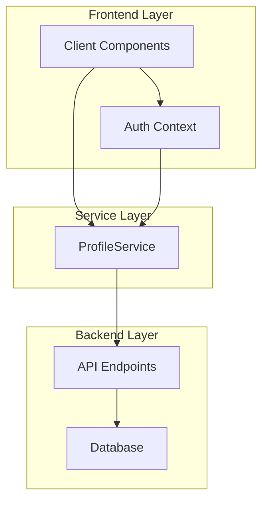
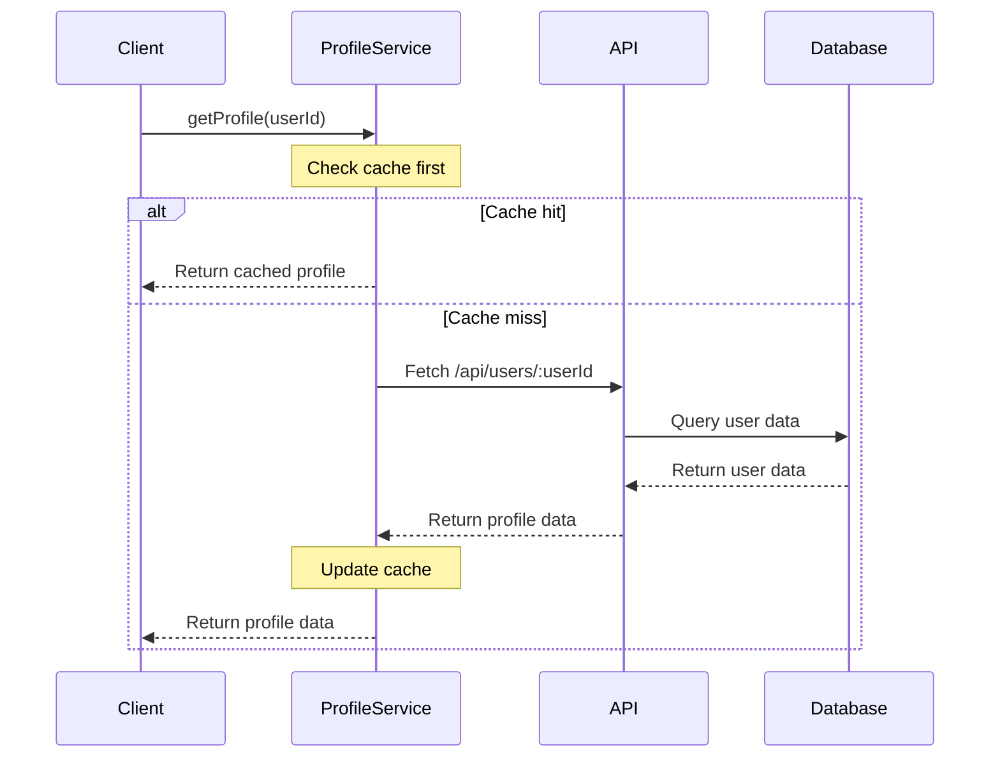
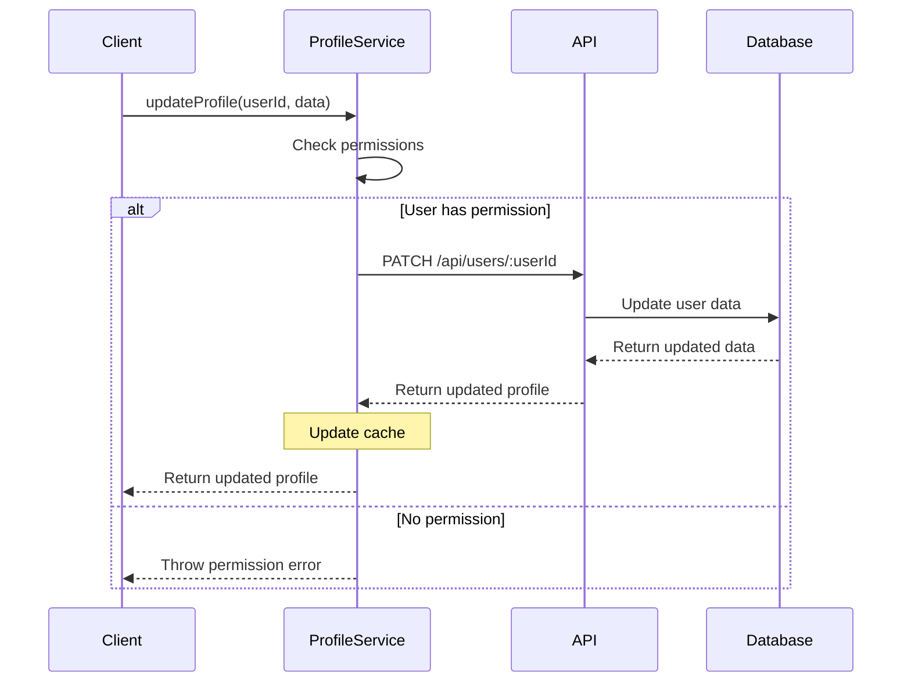

# GoatedVIPs User Profile System Audit

## Overview

The GoatedVIPs platform implements a comprehensive user profile system that manages user information, handles authentication status, and controls access permissions. This audit examines the current implementation, identifies potential optimization areas, and provides recommendations for refinement.

## System Architecture

The profile system follows a layered architecture with clear separation of concerns:

## Key Components

### Frontend Components

1. **ProfileService (`client/src/services/profileService.ts`)**
   - Central profile management service
   - Handles caching of profile data
   - Provides ownership validation
   - Manages profile updates and retrieval

2. **Authentication Context (`client/src/hooks/use-auth.tsx`)**
   - Manages authentication state
   - Provides current user information
   - React Query integration for data fetching
   - Exposes login/logout functionality

3. **AdminRoute Component (`client/src/components/AdminRoute.tsx`)**
   - Protects admin routes from unauthorized access
   - Integrates with auth context for permissions
   - Handles loading states

### Backend Components

1. **User API Routes**
   - `/api/users/:userId` - Get/update user profiles
   - `/api/users/search` - Search for users
   - `/api/users/:userId/stats` - Get detailed user stats

2. **Authentication Routes**
   - `/api/login` - User login
   - `/api/register` - User registration
   - `/api/logout` - User logout
   - `/api/user` - Get current user

## Data Flow Analysis

### Profile Retrieval Flow

### Profile Update Flow

## Audit Findings

### Strengths

1. **Well-Implemented Service Layer**
   - Proper separation of concerns
   - Comprehensive error handling
   - Effective caching strategy

2. **Type Safety**
   - Strong TypeScript interfaces
   - Zod schema validation for profile data
   - Proper handling of both numeric and string IDs

3. **Ownership Validation**
   - Robust `isProfileOwner` method
   - Handles edge cases (string vs numeric IDs)
   - Properly integrates with authentication context

4. **Performance Optimizations**
   - In-memory profile caching
   - Cache invalidation mechanisms
   - Batch profile prefetching capability

### Areas for Improvement

1. **Unused or Redundant Code**
   - Some TypeScript interfaces could be consolidated
   - Profile schema contains fields not currently used in the UI
   - Error handling pattern varies across different methods

2. **Code Organization**
   - Some profile-related logic exists outside ProfileService
   - Inconsistent API endpoint usage patterns
   - Potential to further centralize profile-related utilities

3. **Authentication Integration**
   - Tight coupling between auth context and profile service
   - Manual synchronization of current user to profile service
   - No automatic refresh mechanism for profile data

## Recommendations

### Short-Term Improvements

1. **Enhanced Error Handling**
   - Standardize error messages across the profile system
   - Implement more specific error types for different failure scenarios
   - Add detailed error logging for debugging

2. **Profile Service Refinement**
   - Add methods for common profile-related operations 
   - Consolidate duplicate fetch logic
   - Improve API error recovery mechanisms

3. **Ownership Check Enhancement**
   - Add additional validation for profile editing actions
   - Create higher-level permission system (view, edit, admin)
   - Document ownership check patterns for developers

### Long-Term Improvements

1. **Advanced Caching Strategy**
   - Implement React Query integration directly in ProfileService
   - Add support for background refresh of cache data
   - Implement optimistic updates for profile changes

2. **Profile Component System**
   - Create a component library specifically for profile UI elements
   - Standardize profile display patterns
   - Implement proper loading and error states

3. **Service Architecture Enhancement**
   - Further separate concerns between auth and profile management
   - Create a unified data fetching layer
   - Implement event-based cache invalidation

## Implementation Plan

### Phase 1: Immediate Cleanup

1. Centralize error handling patterns
2. Document profile access patterns
3. Add comprehensive JSDoc comments to ProfileService methods
4. Add ownership checks to all profile editing components
5. Create usage examples for common profile operations

### Phase 2: Service Layer Enhancement

1. Enhance ProfileService with additional methods
2. Improve caching mechanism
3. Add comprehensive performance metrics
4. Create profile-specific UI component library
5. Implement real-time profile updates

## Conclusion

The GoatedVIPs profile system is well-designed with strong type safety, effective caching, and robust ownership validation. The main opportunities for improvement are in standardizing error handling, centralizing common profile operations, and enhancing the authentication integration. By implementing the recommended changes, the system will become more maintainable, performant, and developer-friendly.
