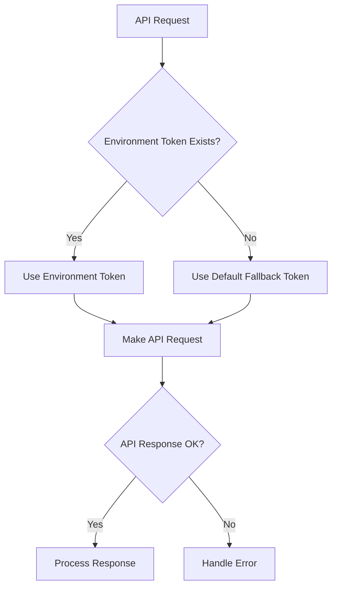

# GoatedVips Active Context

## Current Focus
The current development focus is on improving the integration with the Goated.com API, particularly addressing token management and ensuring secure, reliable API communication between GoatedVips and Goated.com.

## Recent Changes

### API Token Management Improvement
- Implemented a fallback token mechanism in the `api-token.ts` utility
- Added the latest Goated.com API JWT token as a default fallback option
- Created a robust token retrieval system that first checks environment variables before using the fallback
- Developed test utilities to validate token functionality

### Specific Implementations
1. Updated `getApiToken()` function to include fallback mechanism
2. Created testing utilities (`test-token.js`) to validate API connectivity
3. Refactored `UserService` to use the centralized API token utilities
4. Verified token functionality with successful API test connections

## Current Status
The API token integration is now working properly. The test utility confirms successful communication with the Goated.com API, and the user service has been updated to use the centralized token management system.

## Next Steps
1. **Short-term priorities**:
   - Implement token refresh mechanism for expired tokens
   - Add monitoring for API request failures
   - Update other services to use the centralized token management

2. **Medium-term priorities**:
   - Develop a more robust error handling system for API communication
   - Implement caching for frequently requested API data
   - Create admin dashboard for API status monitoring

3. **Long-term considerations**:
   - Evaluate transition to OAuth-based authentication if supported by Goated.com
   - Consider implementing a webhook system for real-time data updates

## Current Decisions & Considerations

### Decision: Default Fallback Token
We've implemented a default fallback token in the code to ensure API functionality even when environment variables aren't set. This is a pragmatic approach for development but introduces security considerations that need to be addressed for production:

**Pros:**
- Ensures system functionality during development
- Simplifies local setup for new developers
- Provides graceful degradation if environment variables fail

**Cons:**
- Not ideal for production (tokens should not be in source code)
- Introduces potential security concerns
- May mask configuration issues

**Mitigation:**
- Ensure environment variables are properly set in production
- Add logging when fallback token is used
- Consider implementing token rotation mechanism

### Consideration: API Communication Patterns
As we continue developing the integration with Goated.com API, we need to standardize our approach to API communication:

1. **Centralized vs. Distributed**: Currently implementing a centralized approach through utility functions
2. **Error Handling**: Need consistent approach to API errors across the application
3. **Rate Limiting**: Need to respect API rate limits and implement backoff strategies
4. **Caching**: Consider implementing caching for frequently accessed data
