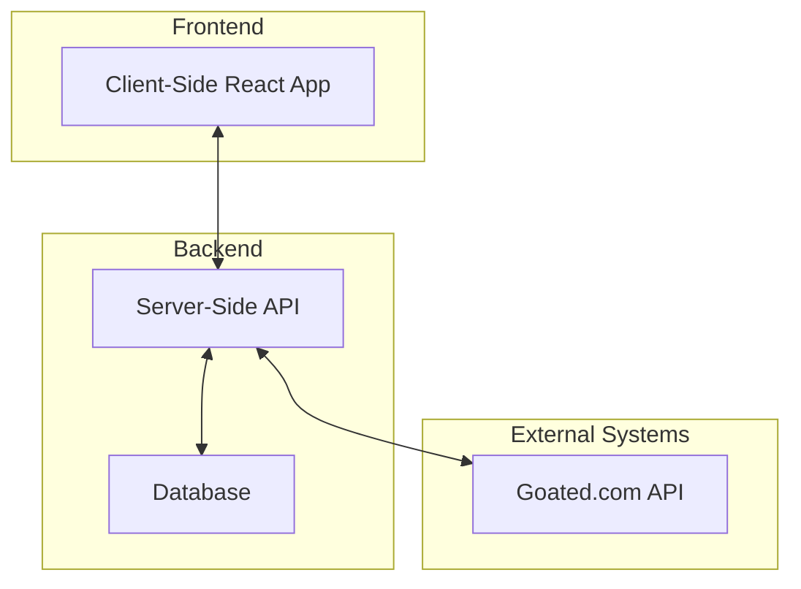
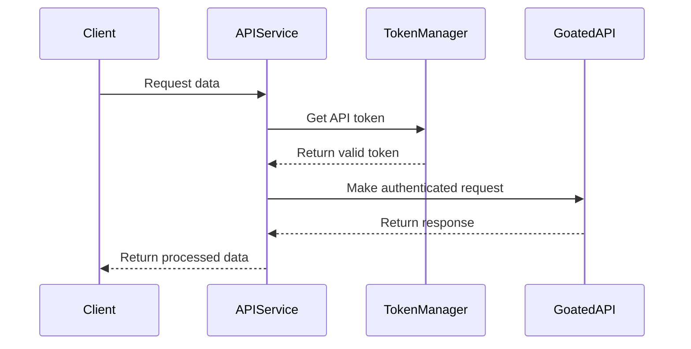
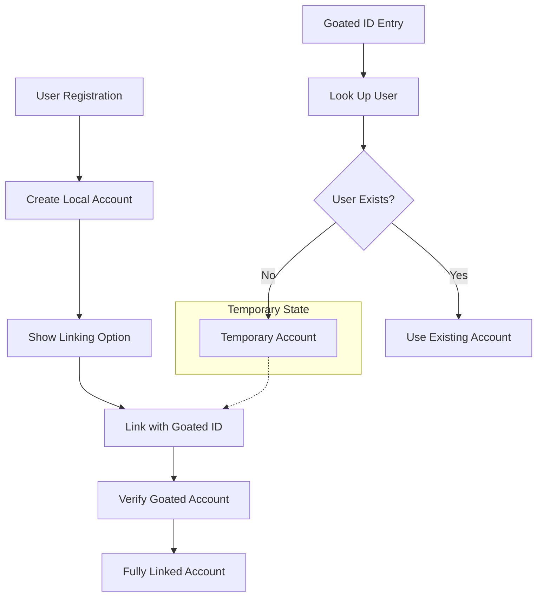
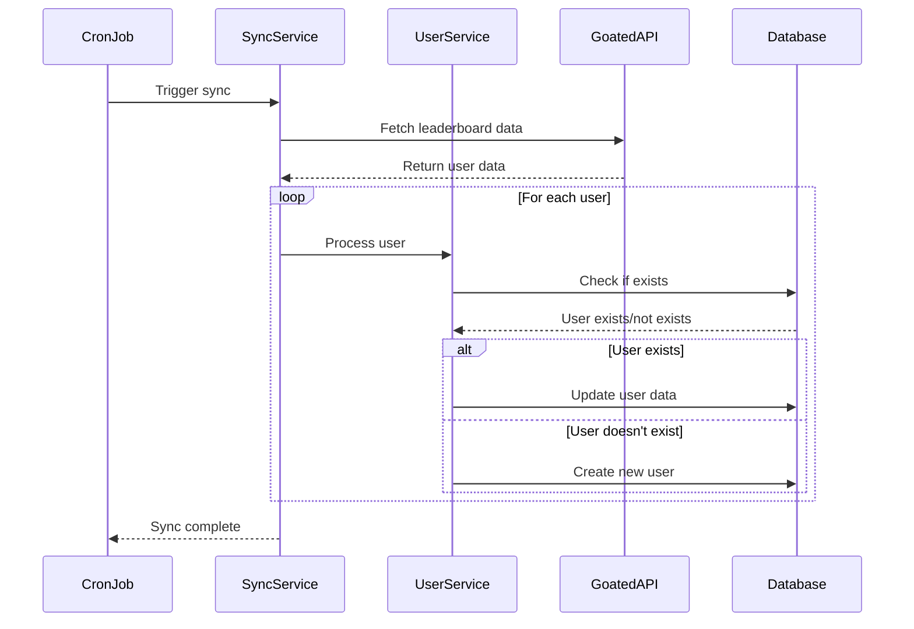
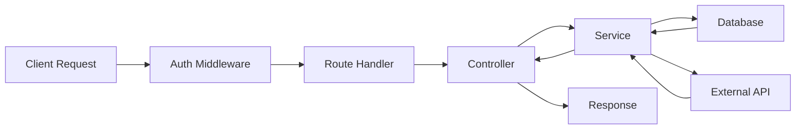

# GoatedVips System Patterns

## System Architecture

GoatedVips follows a modern web application architecture with clear separation of concerns:

### Frontend Architecture
- Single-page application (SPA) built with React
- Component-based UI structure with reusable elements
- State management with React hooks
- Client-side routing with React Router
- API client for backend communication

### Backend Architecture
- Node.js server with Express.js framework
- RESTful API endpoints for client communication
- Service-oriented structure with separation of concerns
- Database access through abstraction layers

## Design Patterns

### API Integration Pattern
For Goated.com API integration, we use a secure token-based approach:

- API tokens are securely stored and managed
- Token rotation and expiration handling
- Centralized API utility functions
- Error handling and retry mechanisms

### User Account Linking Pattern
For connecting user accounts between GoatedVips and Goated.com:

- Support for direct registration and Goated ID-based accounts
- Verification process to confirm Goated.com account ownership
- Temporary account handling for unverified users
- Account merging for users with multiple identities

### Data Synchronization Pattern
For maintaining consistent data with Goated.com:

- Periodic synchronization of user data from Goated.com
- Differential updates to avoid unnecessary database operations
- Conflict resolution strategies
- Logging and monitoring of sync operations

## Data Flow Patterns

### API Request Flow

- Consistent middleware approach for authentication and validation
- Separation of route handlers from business logic
- Service layer for business rules and data access
- Consistent error handling and response formatting
